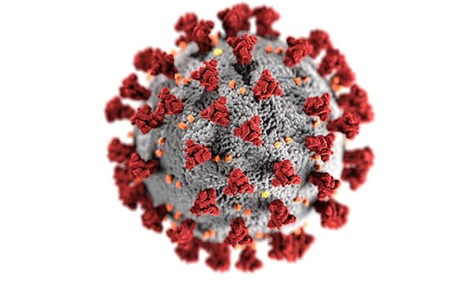
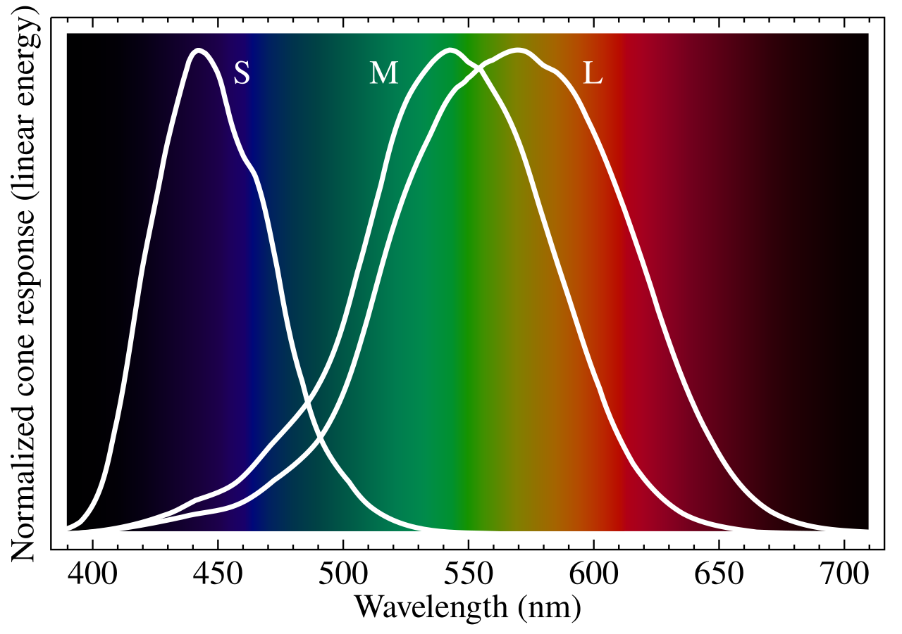
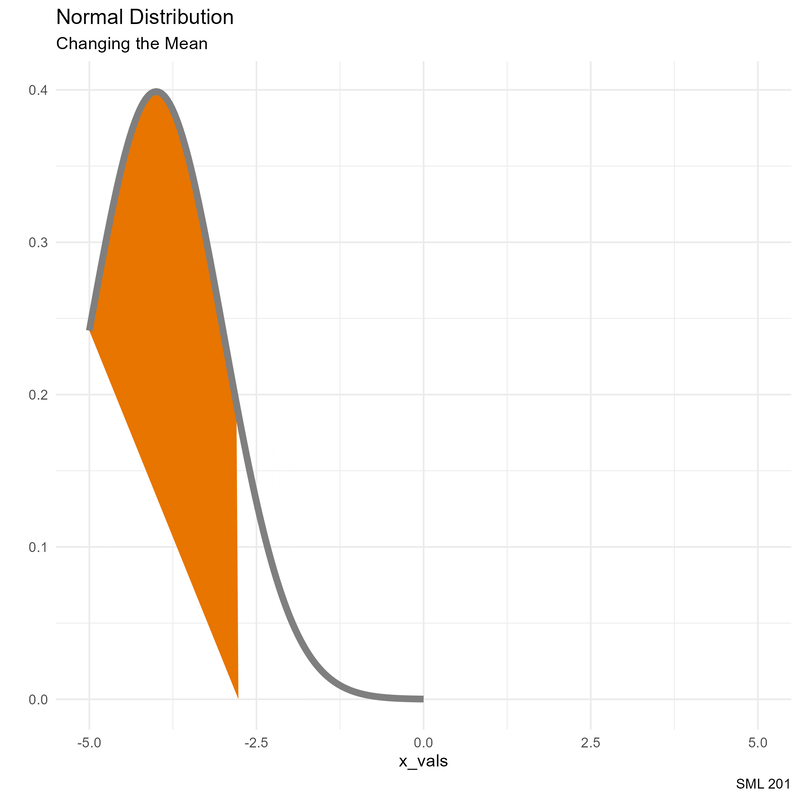
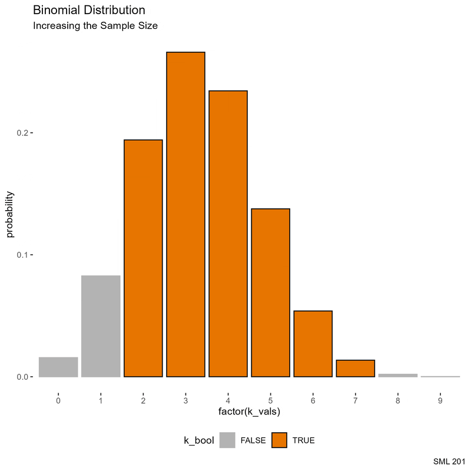
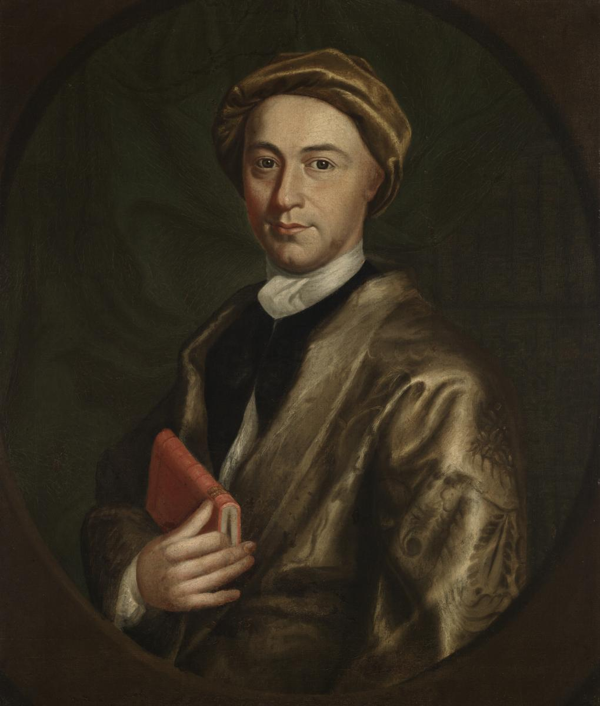

# SML 201

## Start

:::: {.columns}

::: {.column width="50%"}
* **Goal**: Introduce social science

* **Objective**: Compute probabilities with the normal distribution
:::

::: {.column width="10%"}

:::

::: {.column width="40%"}

:::

::::

::: {.callout-note collapse="true"}
## Libraries and Helper Functions

```{r}
#| message: false
#| warning: false
library("gt")        #great tables
library("janitor")   #helps with counts and proportions
library("patchwork") #side-by-side plots
library("tidyverse") #tools for data wrangling and visualization

# school colors
princeton_orange <- "#E77500"
princeton_black  <- "#121212"
```

```{r}
# helper function
vnorm <- function(x, mu = 0, sigma = 1, section = "lower"){
  
  # bell curve
  x_vals <- seq(mu - 4*sigma, mu + 4*sigma, length.out = 201)
  y_vals <- dnorm(x_vals, mu, sigma)
  df_for_graph <- data.frame(x_vals, y_vals)
  
  # outline shaded regions
  if(length(x) == 1){
    shade_left <- rbind(c(x[1],0), df_for_graph |>
                          filter(x_vals < x[1]))
    shade_right <- rbind(c(x[1],0), df_for_graph |>
                           filter(x_vals > x[1]))
  }
  if(length(x) == 2){
    shade_between <- rbind(c(x[1],0),
                           df_for_graph |>
                             filter(x_vals > x[1] &
                                      x_vals < x[2]),
                           c(x[2],0))
    shade_tails <- rbind(df_for_graph |>
                           filter(x_vals < x[1]),
                         c(x[1],0),
                         c(x[2],0),
                         df_for_graph |>
                           filter(x_vals > x[2]))
  }
  if(section %in% c("less", "lower")){
    bell_curve <- df_for_graph |>
      ggplot(aes(x_vals, y_vals)) +
      geom_polygon(aes(x = x_vals, y = y_vals),
                   data = shade_left,
                   fill = "#E77500",) +
      geom_line(color = "gray50", linewidth = 2)
    prob_val <- round(pnorm(x,mu,sigma), 4)
  }
  if(section %in% c("greater", "upper")){
    bell_curve <- df_for_graph |>
      ggplot(aes(x_vals, y_vals)) +
      geom_polygon(aes(x = x_vals, y = y_vals),
                   data = shade_right,
                   fill = "#E77500",) +
      geom_line(color = "gray50", linewidth = 2)
    prob_val <- 1 - round(pnorm(x,mu,sigma), 4)
  }
  if(section == "between"){
    bell_curve <- df_for_graph |>
      ggplot(aes(x_vals, y_vals)) +
      geom_polygon(aes(x = x_vals, y = y_vals),
                   data = shade_between,
                   fill = "#E77500",) +
      geom_line(color = "gray50", linewidth = 2)
    prob_val <- round(diff(pnorm(x,mu,sigma)), 4)
  }
  if(section %in% c("tails", "two.sided", "two_sided")){
    bell_curve <- df_for_graph |>
      ggplot(aes(x_vals, y_vals)) +
      geom_polygon(aes(x = x_vals, y = y_vals),
                   data = shade_tails,
                   fill = "#E77500",) +
      geom_line(color = "gray50", linewidth = 2)
    prob_val <- round(1 - diff(pnorm(x,mu,sigma)), 4)
  }
  
  # plot bell curve
  bell_curve + 
    labs(subtitle = paste0("Probability: ", prob_val),
         caption = "SML 201", y = "") +
    theme_minimal()
}
```

```{r}
vbinom <- function(k_obs, n, p, labels = TRUE){
  # make data frame
  k_vals <- 0:n
  pk     <- dbinom(k_vals, n, p)
  k_bool <- k_vals %in% k_obs
  df_binom <- data.frame(k_vals, pk, k_bool)
  
  # compute requested probability
  answer_prob = round(sum(dbinom(k_obs, n, p)), 4)
  
  # define bar plot
  this_plot <- if(labels){
    df_binom |>
      ggplot(aes(x = factor(k_vals), y = pk, color = k_bool, fill = k_bool)) +
      geom_bar(stat = "identity") +
      geom_label(aes(x = factor(k_vals), y = pk, label = round(pk, 4)),
                 color = "black", fill = "white") +
      labs(subtitle = paste0("n = ", n, ", k = ", list(k_obs), ", p = ", p, ", P(k = ", list(k_obs), ") = ", answer_prob),
           caption = "SML 201",
           y = "probability") +
      scale_color_manual(values = c("gray70", "#121212")) +
      scale_fill_manual(values = c("gray70", "#E77500")) +
      theme(
        legend.position = "bottom",
        panel.background = element_blank()
      )
  } else{
    df_binom |>
      ggplot(aes(x = factor(k_vals), y = pk, color = k_bool, fill = k_bool)) +
      geom_bar(stat = "identity") +
      labs(subtitle = paste0("n = ", n, ", k = ", list(k_obs), ", p = ", p, ", P(k = ", list(k_obs), ") = ", answer_prob),
           caption = "SML 201",
           y = "probability") +
      scale_color_manual(values = c("gray70", "#121212")) +
      scale_fill_manual(values = c("gray70", "#E77500")) +
      theme(
        legend.position = "bottom",
        panel.background = element_blank()
      )
  }
  
  # plot bar chart
  this_plot
}
```

:::

# Normal Distribution

:::{.callout-note}
## General Normal Distribution

When we model applications with $X \sim N(\mu, \sigma^{2})$, by applying the $z$-score transformation 

$$z = \frac{x - \mu}{\sigma}$$

the normal distribution has probability density function 

$$\text{PDF: } f(x; \mu, \sigma) = \frac{1}{\sigma\sqrt{2\pi}} \cdot e^{-\frac{1}{2}\left(\frac{x-\mu}{\sigma}\right)^{2}}$$

and cumulative distribution function

$$F(x) = \Phi\left(\frac{x-\mu}{\sigma}\right) = \frac{1}{2}\left[1 + \text{erf}\left(\frac{x-\mu}{\sigma\sqrt{2}}\right)\right]$$

$$~$$

R code: `pnorm(x, mu, sd)`
:::

## Examples

::::: {.panel-tabset}

## Fewer

:::: {.columns}

::: {.column width="45%"}
Suppose that the incubation period---that is, the time between being infected with the virus and showing symptoms---for Covid-19  is normally distributed with a mean of 8 days and a standard deviation of 3 days. Find the probability that a randomly selected case demonstrated symptoms in fewer than 7 days.	
:::

::: {.column width="10%"}
	
:::

::: {.column width="45%"}


* image credit: University of Chicago

:::

::::

```{r}
#| echo: false
vnorm(7, 8, 3) +
  labs(title = "Covid-19 Example",
       x = "days")
```

* `pnorm(7, 8, 3)`
* `vnorm(7, 8, 3)`


## More

:::: {.columns}

::: {.column width="45%"}
Girl Scout Thin Mint cookies have a mean size of 0.25 ounces. Find the probability that one randomly selected cookie has a size of more than 0.27 ounces if the standard  deviation is 0.03 ounces. Assume a normal distribution.
:::

::: {.column width="10%"}
	
:::

::: {.column width="45%"}


:::

::::

```{r}
#| echo: false
vnorm(0.27, 0.25, 0.03, section = "upper") +
  labs(title = "Thin Mints Example",
       x = "ounces")
```

* `pnorm(0.27, 0.25, 0.03, lower.tail = FALSE)`
* `vnorm(0.27, 0.25, 0.03, section = "greater")`


## Between

:::: {.columns}

::: {.column width="45%"}
The cones in the eye detect light. The absorption rate of cones is normally distributed.  In  particular, the “green” cones have a mean of 535 nanometers and a standard deviation of 65 nanometers.  If an incoming ray of light has wavelengths between 550 and 575 nanometers, calculate the percentage of that ray of light that will be absorbed by the green cones.
:::

::: {.column width="10%"}
	
:::

::: {.column width="45%"}



:::

::::

```{r}
#| echo: false
vnorm(c(550, 575), 535, 65, section = "between") +
  labs(title = "Eye Cones Example",
       x = "nanometers")
```

* `pnorm(575, 535, 65) - pnorm(550, 535, 65)`
* `vnorm(c(550, 575), 535, 65, section = "between")`


## Characterize

:::: {.columns}

::: {.column width="45%"}
Suppose that the number of french fries in the batches at In-n-Out are normally distributed with a mean of 42 french fries and a standard deviation of 3.7 french fries.  Your friend tells you that the In-n-Out employee is flirting with you if you end up with a french fry count in the top 5 percent. How should we characterize the top 5 percent of french fries?
:::

::: {.column width="10%"}
	
:::

::: {.column width="45%"}


:::

::::

```{r}
#| echo: false
vnorm(qnorm(0.95, 42, 3.7), 42, 3.7, section = "upper") +
  labs(title = "Hamburger Example",
       x = "French Fries")
```

* `qnorm(0.95, 42, 3.7)`
* `vnorm(qnorm(0.95, 42, 3.7), 42, 3.7, section = "greater")`

:::::

::: {.callout-warning}
## DCP1
:::

# Intuition

In order to help students build intuition about the normal distribution, we statistics teachers like to say the following 3 statements about the standard normal distribution ($\mu = 0$, $\sigma = 1$).

::::: {.panel-tabset}

## one SD

```{r}
vnorm(c(-1,1), 0, 1, section = "between") +
  labs(title = "About 68 percent of data falls\nwithin one standard deviation of the mean",
       x = "z")
```

## 2 SD

```{r}
vnorm(c(-2,2), 0, 1, section = "between") +
  labs(title = "About 95 percent of data falls\nwithin 2 standard deviations of the mean",
       x = "z")
```

## 3 SD

```{r}
vnorm(c(-3,3), 0, 1, section = "between") +
  labs(title = "About 99 percent of data falls\nwithin 3 standard deviations of the mean",
       x = "z")
```

:::::


# Scenario: Mean Corpuscular Volume

The **mean corpusular volume** or **mean cell volume** (MCV) is the average volume of a red blood cell.  The following information was gathered, adapted, heavily rounded from the [Wikipedia page](https://en.wikipedia.org/wiki/Mean_corpuscular_volume#cite_note-2), and should not constitute medical advice.  For these mathematical examples, assume that the mean MCV is $\mu = 90$ fL/cell with a standard deviation of $\sigma = 5$ fL/cell and that we can apply the normal distribution based on numerous blood tests.

::::: {.panel-tabset}

## Reference Range

[MedScape](https://emedicine.medscape.com/article/2085770-overview) says that the *reference range* for MCV is from 80 to 96 fL/cell.  Find the probability that a randomly selected blood test will fall within the reference range.  This is also known as **normocytic** size for MCV.

```{r}
vnorm(c(80, 96), 90, 5, section = "between") +
  labs(title = "MCV Reference Range",
       x = "fL/cell")
```

## Microcytic

**Microcytic anemia** describes low levels of MCV and could be caused by diseases such as thalassemia.  If microcytic anemia is diagnosed at MCV levels *below* 80 fL/cell, find the probability that a randomly selected blood test will suggest microcytic anemia.

```{r}
vnorm(80, 90, 5) +
  labs(title = "Microcyctic anemia",
       x = "fL/cell")
```

## Macrocyctic

**Macrocytic** or **pernicious anemia** describes high levels of MCV, and that may be caused by a nutrient deficiency (for instance, deficiency of vitamin B12).  Find the probability that a randomly selected blood test will report an MCV value *above* 96 fL/cell.

```{r}
vnorm(96, 90, 5, section = "upper") +
  labs(title = "MCV Reference Range",
       x = "fL/cell")
```

:::::


::: {.callout-warning}
## DCP2
:::

## Simulation

Suppose that we have 10000 patients whose MCV has mean $\mu = 90$ fL/cell with a standard deviation of $\sigma = 5$ fL/cell.  From the simulation, what percentage of patients were in each diagnosis category (reference range, microcyctic anemia, macrocyctic anemia)?

```{r}
num_patients <- 1e5
df_mcv <- data.frame(
  id = 1:num_patients,
  mcv = rnorm(num_patients, 90, 5)
)
```

```{r}
df_mcv <- df_mcv |>
  mutate(diagnosis = case_when(
    mcv >= 96 ~ "macrocyctic anemia",
    mcv <= 80 ~ "microcyctic anemia",
    .default = "reference range"
  ))
```

```{r}
# janitor package helps find proportions
df_mcv |>
  tabyl(diagnosis) |>
  adorn_totals("row") |>
  adorn_pct_formatting()
```

## Exogenous

Suppose that we have 10000 patients *from a different population* whose MCV has mean $\mu = 88$ fL/cell with a standard deviation of $\sigma = 3$ fL/cell.  From the simulation, what percentage of patients were in each diagnosis category (reference range, microcyctic anemia, macrocyctic anemia)?

```{r}
df_mcv <- df_mcv |>
  mutate(mcv2 = rnorm(num_patients, 88, 3))
```

```{r}
df_mcv <- df_mcv |>
  mutate(diagnosis2 = case_when(
    mcv2 >= 96 ~ "macrocyctic anemia",
    mcv2 <= 80 ~ "microcyctic anemia",
    .default = "reference range"
  ))

df_mcv |>
  tabyl(diagnosis2) |>
  adorn_totals("row") |>
  adorn_pct_formatting()
```


# Case Study: Testosterone

::::: {.panel-tabset}

## stats

* men testosterone levels: $\bar{x} = 14.6, s = 6.7$ nmol/L
* women testosterone levels: $\bar{x} = 2.7, s = 4.3$ nmol/L
* IAAF testing limit (until 2021): 10 nmol/L

Healy, M.L., Gibney, J., Pentecost, C., Wheeler, M.J. and Sonksen, P.H. (2014), [Endocrine profiles in 693 elite athletes in the postcompetition setting](https://onlinelibrary.wiley.com/doi/full/10.1111/cen.12445). Clin Endocrinol, 81: 294-305. https://doi.org/10.1111/cen.12445

## men

```{r}
#| echo: false
plot_men <- vnorm(10, 14.6, 6.7, section = "upper") +
  labs(title = "Men's Testosterone Levels",
       subtitle = "IAAF threshold: 10 nmol/L",
       caption = "SML 201",
       x = "testosterone (nmol/L)")

plot_men
```

## women

```{r}
#| echo: false
plot_women <- vnorm(10, 2.7, 4.3) +
  labs(title = "Women's Testosterone Levels",
       subtitle = "IAAF threshold: 10 nmol/L",
       caption = "SML 201",
       x = "testosterone (nmol/L)")

plot_women
```

## patchwork

```{r}
#| echo: false
#| warning: false

plot_men <- plot_men + xlim(0, 40)
plot_women <- plot_women + coord_cartesian(xlim = c(0, 40))

plot_men / plot_women
```

## testing

```{r}
#| echo: false

prob_exceeded <- 1 - pnorm(10, 2.7, 4.3)

vnorm(10, 2.7, 4.3, section = "upper") +
  coord_cartesian(xlim = c(0, 20)) +
  labs(title = "Was this test fair for women athletes?",
       subtitle = paste0("Probability of exceeding threshold: ", round(prob_exceeded, 4)),
       caption = "SML 201",
       x = "testosterone (nmol/L)")
```

Further thoughts:

* The probability of exceeding the threshold is not zero
* So far, one explanatory variable
* Does this show causation with performance enhancing?
* Probabilistic computation assumed normal distribution.  One could use a nonnegative, skewed (not symmetric) distribution, such as a beta distribution.

## codes

```{r}
#| eval: false

plot_men <- vnorm(10, 14.6, 6.7, section = "upper") +
  labs(title = "Men's Testosterone Levels",
       subtitle = "IAAF threshold: 10 nmol/L",
       caption = "SML 201",
       x = "testosterone (nmol/L)")

plot_women <- vnorm(10, 2.7, 4.3) +
  labs(title = "Women's Testosterone Levels",
       subtitle = "IAAF threshold: 10 nmol/L",
       caption = "SML 201",
       x = "testosterone (nmol/L)")

# patchwork
plot_men <- plot_men + xlim(0, 40)
plot_women <- plot_women + coord_cartesian(xlim = c(0, 40))
plot_men / plot_women

prob_exceeded <- 1 - pnorm(10, 2.7, 4.3)
vnorm(10, 2.7, 4.3, section = "upper") +
  coord_cartesian(xlim = c(0, 20)) +
  labs(title = "Was this test fair for women athletes?",
       subtitle = paste0("Probability of exceeding threshold: ", round(prob_exceeded, 4)),
       caption = "SML 201",
       x = "testosterone (nmol/L)")
```

## further

Further Reading

* [Endocrine profiles in 693 elite athletes in the postcompetition setting](https://onlinelibrary.wiley.com/doi/full/10.1111/cen.12445) by Healy, et al
* [Testosterone Levels by Age](https://www.healthline.com/health/low-testosterone/testosterone-levels-by-age) at Health Line
* [Testosterone levels won't determine transgender athletes' eligibility, IOC says](https://www.npr.org/2021/11/18/1056761957/testosterone-levels-wont-determine-transgender-athletes-eligibility-ioc-says) by Tom Goldman
* [Fairness, Inclusion and
Non-Discrimination in Olympic Sport](https://www.olympics.com/ioc/human-rights/fairness-inclusion-nondiscrimination) statement by the International Olympic Committee
* [Transwoman Elite Athletes: Their Extra Percentage Relative to Female Physiology](https://pmc.ncbi.nlm.nih.gov/articles/PMC9331831/) by Sims and Minson

:::::


# Animations

The `gifski` package allows us to make animations from a collection of still images.

## Horizontal Translation

* `mu_vals <- seq(-4, 4, by = 0.5)`
* $x \in [\mu - 1.23, \mu  + 1.23]$
* $\sigma = 1$

```{r}
#| eval: false
mu_vals <- seq(-4, 4, by = 0.5)
N <- length(mu_vals)

for(i in 1:N){
  this_plot <- vnorm(c(mu_vals[i] - 1.23, mu_vals[i] + 1.23), 
                     mu_vals[i], 1, section = "between") +
    labs(title = "Normal Distribution",
         subtitle = "Changing the Mean") +
    xlim(-5, 5)
  ggsave(paste0("images/norm_plot", LETTERS[i], ".png"), this_plot)
}

png_files <- Sys.glob("images/norm_plot*.png")

gifski::gifski(
  png_files,
  "norm_animation.gif",      #output file name
  height = 800, width = 800, #you may change the resolution
  delay = 1/2                #seconds
)
```



## Increasing Sample Size

Here we will use the `vbinom` function with various increasing values for the sample size $n$ and a constant value for the population proportion $p$.

* `n_vals <- seq(9, 30)`

```{r}
#| eval: false
n_vals <- seq(9, 30)
p      <- 0.37
N      <- length(n_vals)

for(i in 1:N){
  this_plot <- vbinom(round(n_vals[i]/4):round(3*n_vals[i]/4), 
                      n_vals[i], p, labels = FALSE) +
    labs(title = "Binomial Distribution",
         subtitle = "Increasing the Sample Size")
  ggsave(paste0("images/CLT_plot", LETTERS[i], ".png"), this_plot)
}

png_files <- Sys.glob("images/CLT_plot*.png")

gifski::gifski(
  png_files,
  "CLT_animation.gif",    #output file name
  height = 800, width = 800, #you may change the resolution
  delay = 1/3                #seconds
)
```


# Toward Significance

Traditionally, scientists sought out extreme values among the 5 percent probability combined in the tails.  What are the MCV levels for these regions?

```{r}
qnorm(c(0.025, 0.975), 90, 5)
```

::: {.callout-note}
## Centered Area

In upcoming statistics tools, it is common to request 95 percent centered probability (especially with symmetric distributions).

* Leaves 5 percent area in the tails
* Each tail's boundary is at the 2.5 and 97.5 percentiles respectively
:::

```{r}
vnorm(qnorm(c(0.025, 0.975), 90, 5), 
      90, 5, section = "tails") +
  labs(title = "Two-Tailed Significance",
       x = "fL/cell")
```
::: {.callout-warning}
## DCP3
:::


# Bell Curve History

::::: {.panel-tabset}

## Galton

:::: {.columns}

::: {.column width="40%"}
	
:::

::: {.column width="10%"}
	
:::

::: {.column width="50%"}
* 1822 - 1911
* cousin of Charles Darwin
* correlation discovery

> **regression** to the mean

:::

::::

## Quetelet

:::: {.columns}

::: {.column width="45%"}
	
:::

::: {.column width="10%"}
	
:::

::: {.column width="45%"}
> Could anything be said about the *regularity* with which individuals differences of various magnitudes could be expected?  Quetelet answered in the affirmative, drawing inspiration again from a tool of astronomy: Laplace's *law of distribution of error*, or what we now call the **normal distribution**

---*Bernoulli's Fallacy*, page 114

:::

::::


## legacy

:::: {.columns}

::: {.column width="45%"}
> the perfect tool for a mind like Galton's, seeking structure and ordered hierarchies out of the messy chaos of human variety.  His interest in the **distribution** was, in a sense, the polar opposite of Quetelet's.  Where Quetelet had used the normal error laaw to glorify the average man, Galton focused on the extremes

---*Bernoulli's Fallacy*, page 137
:::

::: {.column width="10%"}
	
:::

::: {.column width="45%"}
> Putting these two ideas together was the grand project of 20th century evolutionary biology now called the *modern synthesis*. One of the chief obstacles to achieving that synthesis was that certain traits, say height or skull size, appeared to vary *continuously* in a population

---*Bernoulli's Fallacy*, page 153
:::

::::

::: {.callout-warning}
## Modern Synthesis

*statistics* + *genetics* $\rightarrow$ **eugenics**
:::

## uni

:::: {.columns}

::: {.column width="45%"}
	
:::

::: {.column width="10%"}
	
:::

::: {.column width="45%"}
Yale president Ezra Stiles implemented the first grading scale in the United States based on four descriptions: 

* Optimi
* Second Optimi
* Inferiores
* Perjores

---[TurnItIn](https://www.turnitin.com/blog/what-is-the-history-of-grading)

:::

::::

:::::


# Grading Curves

::::: {.panel-tabset}

## Setup

In a past teaching job, Derek would apply a grading curve as follows:

* "A" to the top 9 percentile
* "A-" to the next 9 percentile
* etc.

## Scenario 1

Suppose that a class of Calculus students took an exam and the grading yielded a sample average of $\bar{x} = 70$ and a sample standard deviation of $s = 15$ percentage points.  Derek's curve would look like

```{r}
#| echo: false
#| eval: true
#| message: false
#| warning: false

xbar <- 70
s <- 15

curve_percentiles <- seq(28, 100, by = 9)/100
breakpoints <- qnorm(curve_percentiles, xbar, s)
df_vert <- data.frame(
  x_breakpoints = breakpoints,
  y_breakpoints = dnorm(breakpoints, xbar, s)
)

p1 <- vnorm(qnorm(0.28, xbar, s), xbar, s, section = "upper") +
  geom_segment(aes(x = x_breakpoints, 
                   y = 0,
                   xend = x_breakpoints, 
                   yend = y_breakpoints),
               data = df_vert) +
  labs(title = "Grading Curve for a Hypothetical Exam",
       x = "percent") +
  scale_x_continuous(
    breaks = breakpoints,
    labels = c("C-", "C", "C+", "B-", "B", "B+", "A-", "A", ""),
    limits = c(50, 125)
  )

p1
```

## Scenario 2

On a recent exam, data science students had a sample average of $\bar{x} = 81.75$ and a sample standard deviation of $s = 13.77$ percentage points.  Derek's curve would look like 

```{r}
#| echo: false
#| eval: true
#| message: false
#| warning: false

xbar <- 81.75
s <- 13.77

curve_percentiles <- seq(28, 100, by = 9)/100
breakpoints <- qnorm(curve_percentiles, xbar, s)
df_vert <- data.frame(
  x_breakpoints = breakpoints,
  y_breakpoints = dnorm(breakpoints, xbar, s)
)

p2 <- vnorm(qnorm(0.28, xbar, s), xbar, s, section = "upper") +
  geom_segment(aes(x = x_breakpoints, 
                   y = 0,
                   xend = x_breakpoints, 
                   yend = y_breakpoints),
               data = df_vert) +
  labs(title = "Grading Curve for Exam 1",
       x = "percent") +
  scale_x_continuous(
    breaks = breakpoints,
    labels = c("C-", "C", "C+", "B-", "B", "B+", "A-", "A", ""),
    limits = c(50, 125)
  )

p2
```

## Comparison

```{r}
#| message: false
#| warning: false
# patchwork
p1 / p2
```

## Codes

```{r}
#| echo: true
#| eval: false
#| message: false
#| warning: false

xbar <- 70
s <- 15

curve_percentiles <- seq(28, 100, by = 9)/100
breakpoints <- qnorm(curve_percentiles, xbar, s)
df_vert <- data.frame(
  x_breakpoints = breakpoints,
  y_breakpoints = dnorm(breakpoints, xbar, s)
)

p1 <- vnorm(qnorm(0.28, xbar, s), xbar, s, section = "upper") +
  geom_segment(aes(x = x_breakpoints, 
                   y = 0,
                   xend = x_breakpoints, 
                   yend = y_breakpoints),
               data = df_vert) +
  labs(title = "Grading Curve for a Hypothetical Exam",
       x = "percent") +
  scale_x_continuous(
    breaks = breakpoints,
    labels = c("C-", "C", "C+", "B-", "B", "B+", "A-", "A", ""),
    limits = c(50, 125)
  )

p1
```

```{r}
#| echo: true
#| eval: false
#| message: false
#| warning: false

xbar <- 81.75
s <- 13.77

curve_percentiles <- seq(28, 100, by = 9)/100
breakpoints <- qnorm(curve_percentiles, xbar, s)
df_vert <- data.frame(
  x_breakpoints = breakpoints,
  y_breakpoints = dnorm(breakpoints, xbar, s)
)

p2 <- vnorm(qnorm(0.28, xbar, s), xbar, s, section = "upper") +
  geom_segment(aes(x = x_breakpoints, 
                   y = 0,
                   xend = x_breakpoints, 
                   yend = y_breakpoints),
               data = df_vert) +
  labs(title = "Grading Curve for Exam 1",
       x = "percent") +
  scale_x_continuous(
    breaks = breakpoints,
    labels = c("C-", "C", "C+", "B-", "B", "B+", "A-", "A", ""),
    limits = c(50, 125)
  )

p2
```

:::::

::: {.callout-warning}
## Dangerous Curves

As we have seen, a grading **curve** can hurt students if the exam average was relatively high.
:::

::: {.callout-tip}
## Nomenclature

Of course, what students are really asking for is a *shift* in the grades, not a curve.
:::


# Quo Vadimus?

:::: {.columns}

::: {.column width="45%"}

* Due this Friday (March 20)

  * Precept 6
  * Coloring Assignment 2
  * Pick Group Partners
  
* Project 2

  * Assigned: March 23
  * Due: April 7

* Exam 2: April 23

* Exam 1 (out of 65 points):

  * average: 53.14
  * deviation: 8.95
  * top 5: 65, 65, 65, 64, 64
:::

::: {.column width="5%"}
	
:::

::: {.column width="50%"}
```{r}
#| echo: false

xbar <- 53.14
s <- 8.95

curve_percentiles <- seq(28, 91, by = 9)/100
breakpoints <- rev(qnorm(curve_percentiles, xbar, s))
letter_grade <- rev(c("C-", "C", "C+", "B-", "B", "B+", "A-", "A"))

data.frame(letter_grade, breakpoints) |>
  gt() |>
  cols_align(align = "center") |>
  tab_footnote(footnote = "Note: this grading curve will not be applied to SML 201") |>
  tab_header(
    title = "If this grading curve was applied",
    subtitle = "to Exam 1 (out of 65 points)"
  ) |>
  tab_style(
    style = cell_text(weight = "bold"),
    locations = cells_column_labels()
  ) |>
  data_color(
    columns = breakpoints,
    target_columns = everything(),
    palette = "OrRd",
    reverse = TRUE
  ) |>
  fmt_number(
    decimals = 2
  )
```
:::

::::


# Footnotes

::: {.callout-note collapse="true"}
## (optional) Additional Resources


:::

::: {.callout-note collapse="true"}
## Session Info

```{r}
sessionInfo()
```
:::


:::: {.columns}

::: {.column width="45%"}
	
:::

::: {.column width="10%"}
	
:::

::: {.column width="45%"}

:::

::::

::::: {.panel-tabset}


:::::