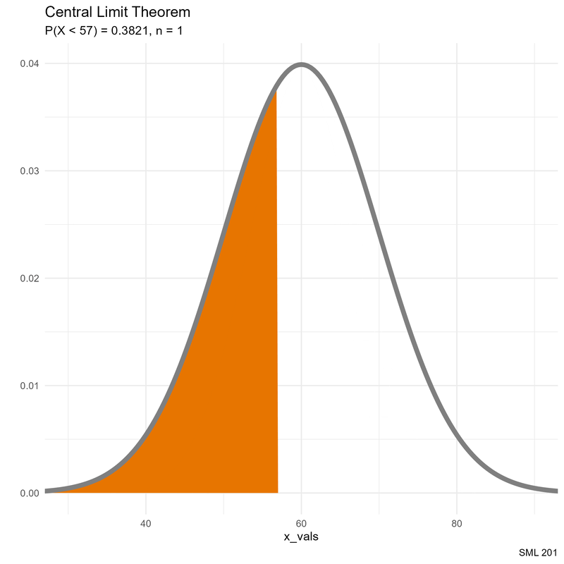

# SML 201

::: {.callout-note collapse="true"}
## Libraries and Helper Functions

```{r}
#| message: false
#| warning: false
library("gt")        #great tables
library("tidyverse") #tools for data wrangling and visualization

# school colors
princeton_orange <- "#E77500"
princeton_black  <- "#121212"
```

```{r}
# helper function
vnorm <- function(x, mu = 0, sigma = 1, section = "lower"){
  
  # bell curve
  x_vals <- seq(mu - 4*sigma, mu + 4*sigma, length.out = 201)
  y_vals <- dnorm(x_vals, mu, sigma)
  df_for_graph <- data.frame(x_vals, y_vals)
  
  # outline shaded regions
  if(length(x) == 1){
    shade_left <- rbind(c(x[1],0), df_for_graph |>
                          filter(x_vals < x[1]))
    shade_right <- rbind(c(x[1],0), df_for_graph |>
                           filter(x_vals > x[1]))
  }
  if(length(x) == 2){
    shade_between <- rbind(c(x[1],0),
                           df_for_graph |>
                             filter(x_vals > x[1] &
                                      x_vals < x[2]),
                           c(x[2],0))
    shade_tails <- rbind(df_for_graph |>
                           filter(x_vals < x[1]),
                         c(x[1],0),
                         c(x[2],0),
                         df_for_graph |>
                           filter(x_vals > x[2]))
  }
  if(section %in% c("less", "lower")){
    bell_curve <- df_for_graph |>
      ggplot(aes(x_vals, y_vals)) +
      geom_polygon(aes(x = x_vals, y = y_vals),
                   data = shade_left,
                   fill = "#E77500",) +
      geom_line(color = "gray50", linewidth = 2)
    prob_val <- round(pnorm(x,mu,sigma), 4)
  }
  if(section %in% c("greater", "upper")){
    bell_curve <- df_for_graph |>
      ggplot(aes(x_vals, y_vals)) +
      geom_polygon(aes(x = x_vals, y = y_vals),
                   data = shade_right,
                   fill = "#E77500",) +
      geom_line(color = "gray50", linewidth = 2)
    prob_val <- 1 - round(pnorm(x,mu,sigma), 4)
  }
  if(section == "between"){
    bell_curve <- df_for_graph |>
      ggplot(aes(x_vals, y_vals)) +
      geom_polygon(aes(x = x_vals, y = y_vals),
                   data = shade_between,
                   fill = "#E77500",) +
      geom_line(color = "gray50", linewidth = 2)
    prob_val <- round(diff(pnorm(x,mu,sigma)), 4)
  }
  if(section %in% c("tails", "two.sided", "two_sided")){
    bell_curve <- df_for_graph |>
      ggplot(aes(x_vals, y_vals)) +
      geom_polygon(aes(x = x_vals, y = y_vals),
                   data = shade_tails,
                   fill = "#E77500",) +
      geom_line(color = "gray50", linewidth = 2)
    prob_val <- round(1 - diff(pnorm(x,mu,sigma)), 4)
  }
  
  # plot bell curve
  bell_curve + 
    labs(subtitle = paste0("Probability: ", prob_val),
         caption = "SML 201", y = "") +
    theme_minimal()
}
```

```{r}
graph_noise <- function(x,y){
  this_df <- data.frame(x = x, y = y)
  lin_fit <- lm(y ~ x, data = this_df)
  coef_det <- summary(lin_fit)$adj.r.squared
  
  this_df |>
    ggplot(aes(x,y)) +
    geom_point(color = princeton_orange) +
    geom_smooth(formula = "y ~ x",
                method = "lm",
                se = TRUE) +
    labs(title = "The Signal and the Noise",
         subtitle = paste0("Coefficient of Determination: ", round(coef_det, 4)),
         caption = "SML 201") +
    theme_minimal()
}
```

:::

## Start

:::: {.columns}

::: {.column width="50%"}
* **Goal**: Estimate known population statistics

* **Objective**: Use density plots to explore biased and unbiased estimators
:::

::: {.column width="10%"}

:::

::: {.column width="40%"}

:::

::::


## Recap: Mean Corpuscular Volume

The mean corpusular volume or mean cell volume (MCV) is the average volume of a red blood cell.  The following information was gathered, adapted, heavily rounded from the [Wikipedia page](https://en.wikipedia.org/wiki/Mean_corpuscular_volume#cite_note-2), and should not constitute medical advice.  For these mathematical examples, **assume that the mean MCV is $\mu = 90$ fL/cell** with a standard deviation of $\sigma = 5$ fL/cell and that we can apply the normal distribution based on numerous blood tests.

::: {.callout-note}
## Estimating Populations

> How did we know that the average MCV was 90 for the entire population?

* We actually don't know the population mean.
* Historical data points toward a *sample mean* of $\bar{x} = 90$ fL/cell.
* Why are we allowed to go from the sample mean $\bar{x}$ to the population mean $\mu$?
:::


# Scenario: D20

::::: {.panel-tabset}

## Outcomes

For today's session, we need a setting with *known* statistics (mean, median, variance, etc.).  Picture a "d20" (i.e. a 20-sided die).  Its outcome space is a discrete uniform distribution (i.e. each outcome is equally likely):

$$X = \{1, 2, 3, 4, 5, 6, 7, 8, 9, 10, 11, 12, 13, 14, 15, 16, 17, 18, 19, 20\}$$

:::: {.columns}

::: {.column width="45%"}

:::

::: {.column width="10%"}
	
:::

::: {.column width="45%"}

:::

::::

## Population Statistics

$$\begin{array}{rrcccl}
  \text{mean: } & \mu & = & \frac{1}{N}\sum_{i=1}^{N} x_{i} & = & 10.5 \\
  \text{median: } & \nu & = & \frac{1}{2}\left(x_{\lfloor\frac{N+1}{2}\rfloor} + x_{\lceil\frac{N+1}{2}\rceil}\right) & = & 10.5 \\
  \text{variance: } & \mu & = & \frac{1}{N}\sum_{i=1}^{N} (x_{i} - \mu)^{2} & = & 33.25 \\
\end{array}$$

## Code

```{r}
# outcome space (already sorted)
d20_die <- 1:20

# population length
N <- length(d20_die)

# population mean
mu <- sum(d20_die)/N

# population median
nu <- 0.5*(d20_die[floor((N+1)/2)] + d20_die[ceiling((N+1)/2)])

# population variance
sigma_sq <- sum((d20_die - mu)^2)/N

# population standard deviation
sigma <- sqrt(sigma_sq)
```

:::::

::: {.callout-note}

## Experiment's Design

1. roll the d20 $n = 10$ times
2. compute a sample stat (e.g. mean)
3. repeat steps (1) and (2) $N = 1000$ times
4. construct density plot of the *sampling distribution*
5. compare the mode(s) of the density plot to population stat
:::


# Biased or Unbiased

## Sample Mean

$$\bar{x} = \frac{1}{n}\sum_{i=1}^{n} x_{i}$$

```{r}
N <- 10000 #number of experiment iterations
samp_dist <- rep(NA, N) #allocate space to store sample calculations

for(i in 1:N){

  #roll d20 n = 10 times
  these_rolls <- sample(d20_die, size = 10, replace = TRUE)
  
  #record this sample stat
  samp_dist[i] <- mean(these_rolls)
}

df_for_graph <- data.frame(
  id = 1:N,
  samp_dist = samp_dist
)
```

```{r}
df_for_graph |>
  ggplot() +
  geom_density(aes(x = samp_dist), 
               color = "black", linewidth = 2) +
  geom_vline(aes(xintercept = mu), 
             color = "red", linewidth = 3) +
  geom_vline(aes(xintercept = mean(samp_dist)), 
             color = princeton_orange, linetype = 2, linewidth = 3) +
  labs(title = "Biased or Unbiased?",
       subtitle = "black: sample distribution\norange: average of samples\nred: true population stat",
       caption = "SML 201") +
  theme_minimal()
```

::: {.callout-tip}
### Interpretation

We say that the sample mean $\bar{x}$ is an **unbiased estimator** for the population mean $\mu$.
:::

::: {.callout-warning}
## DCP1
:::

## Sample Median

$$\nu = \frac{1}{2}\left(x_{\lfloor\frac{n+1}{2}\rfloor} + x_{\lceil\frac{n+1}{2}\rceil}\right)$$

For this experiment, Derek wanted an asymmetrical outcome space.

$$\{1, 2, 3, 14, 16, 18, 20\}$$
whose population median is $\nu = 14$.

```{r}
unfair_die <- c(1, 2, 3, 14, 16, 18, 20)
N <- 10000 #number of experiment iterations
samp_dist <- rep(NA, N) #allocate space to store sample calculations

for(i in 1:N){

  #roll d20 n = 10 times
  these_rolls <- sample(unfair_die, size = 10, replace = TRUE)
  
  #record this sample stat
  samp_dist[i] <- median(these_rolls)
}

df_for_graph <- data.frame(
  id = 1:N,
  samp_dist = samp_dist
)
```

```{r}
df_for_graph |>
  ggplot() +
  geom_density(aes(x = samp_dist), 
               color = "black", linewidth = 2) +
  geom_vline(aes(xintercept = 14), 
             color = "red", linewidth = 3) +
  geom_vline(aes(xintercept = mean(samp_dist)), 
             color = princeton_orange, linetype = 2, linewidth = 3) +
  labs(title = "Biased or Unbiased?",
       subtitle = "black: sample distribution\norange: average of samples\nred: true population stat",
       caption = "SML 201") +
  theme_minimal()
```

::: {.callout-warning}
### Interpretation

Since the modes do not appear to align with the population median, we say that the sample median is a **biased estimator** of the population median.  In our visualizations today, the **bias** is the horizontal distance between the red and orange lines.
:::


## Population Variance

$$\sigma^{2} = \frac{1}{N}\sum_{i=1}^{N} (x_{i} - \mu)^{2}$$

```{r}
pop_var <- function(x){
  N <- length(x)
  mu <- mean(x)
  sigma_sq <- sum((x - mu)^{2})/N
  
  #return
  sigma_sq
}
```


```{r}
N <- 10000 #number of experiment iterations
samp_dist <- rep(NA, N) #allocate space to store sample calculations

for(i in 1:N){

  #roll d20 n = 10 times
  these_rolls <- sample(d20_die, size = 10, replace = TRUE)
  
  #record this sample stat
  samp_dist[i] <- pop_var(these_rolls)
}

df_for_graph <- data.frame(
  id = 1:N,
  samp_dist = samp_dist
)
```

```{r}
df_for_graph |>
  ggplot() +
  geom_density(aes(x = samp_dist), 
               color = "black", linewidth = 2) +
  geom_vline(aes(xintercept = sigma_sq), 
             color = "red", linewidth = 3) +
  geom_vline(aes(xintercept = mean(samp_dist)), 
             color = princeton_orange, linetype = 2, linewidth = 3) +
  labs(title = "Biased or Unbiased?",
       subtitle = "black: sample distribution\norange: average of samples\nred: true population stat",
       caption = "SML 201") +
  theme_minimal()
```

::: {.callout-note collapse="true"}
### Interpretation

Upon reapplying the population variance formula to the samples, we see that the resulting sampling distribution tends to underestimate the true population variance.  So far, this formula is a **biased estimator** of the population variance.
:::


## Sample Variance

$$s^{2} = \frac{1}{n-1}\sum_{i=1}^{n} (x_{i} - \bar{x})^{2}$$

```{r}
samp_var <- function(x){
  n <- length(x)
  xbar <- mean(x)
  
  # Bessel's correction: "n-1"
  s_sq <- sum((x - xbar)^{2})/(n-1)
  
  #return
  s_sq
}
```

```{r}
N <- 10000 #number of experiment iterations
samp_dist <- rep(NA, N) #allocate space to store sample calculations

for(i in 1:N){

  #roll d20 n = 10 times
  these_rolls <- sample(d20_die, size = 10, replace = TRUE)
  
  #record this sample stat
  samp_dist[i] <- samp_var(these_rolls)
}

df_for_graph <- data.frame(
  id = 1:N,
  samp_dist = samp_dist
)
```

```{r}
df_for_graph |>
  ggplot() +
  geom_density(aes(x = samp_dist), 
               color = "black", linewidth = 2) +
  geom_vline(aes(xintercept = sigma_sq), 
             color = "red", linewidth = 3) +
  geom_vline(aes(xintercept = mean(samp_dist)), 
             color = princeton_orange, linetype = 2, linewidth = 3) +
  labs(title = "Biased or Unbiased?",
       subtitle = "black: sample distribution\norange: average of samples\nred: true population stat",
       caption = "SML 201") +
  theme_minimal()
```

::: {.callout-note collapse="true"}
### Interpretation

Now, with Bessel's correction, we say that the sample variance is an **unbiased estimator** for the population variance.
:::

::: {.callout-note collapse="true"}
### (optional) Bessel's Correction

**Claim:** The sample variance formula with $n-1$

$$s^{2} = \frac{1}{n-1}\sum_{i=1}^{n} (x_{i} - \bar{x})^{2}$$
is an unbiased estimator for the population variance $\sigma^{2}$.

**Note**: the "minus one" *adjusts* for the **degrees of freedom**

**Proof**: (omitted)

* takes about 4 Calculus lectures to explain

:::


## Sample Standard Deviation

$$s= \sqrt{\frac{1}{n}\sum_{i=1}^{n} (x_{i} - \bar{x})^{2}}$$

```{r}
set.seed(20241029)
N <- 10000 #number of experiment iterations
samp_dist <- rep(NA, N) #allocate space to store sample calculations

for(i in 1:N){

  #roll d20 n = 10 times
  these_rolls <- sample(d20_die, size = 10, replace = TRUE)
  
  #record this sample stat
  samp_dist[i] <- sqrt(samp_var(these_rolls))
}

df_for_graph <- data.frame(
  id = 1:N,
  samp_dist = samp_dist
)
```

```{r}
df_for_graph |>
  ggplot() +
  geom_density(aes(x = samp_dist), 
               color = "black", linewidth = 2) +
  geom_vline(aes(xintercept = sigma), 
             color = "red", linewidth = 3) +
  geom_vline(aes(xintercept = mean(samp_dist)), 
             color = princeton_orange, linetype = 2, linewidth = 3) +
  labs(title = "Biased or Unbiased?",
       subtitle = "black: sample distribution\norange: average of samples\nred: true population stat",
       caption = "SML 201") +
  theme_minimal()
```

::: {.callout-tip}
### Interpretation

It can be mathematically proven that the sample standard deviation is a *biased* estimator (as it tends to underestimate the true population standard deviation), but the bias is treated as negligible in practice.
:::

::: {.callout-note collapse="true"}
### (optional) Standard Deviation is Technically Biased

**Claim:** The sample standard deviation is a biased estimator

**Proof**: Use Jensen's Inequality

:::


## Sample Extrema

```{r}
N <- 10000 #number of experiment iterations
samp_dist <- rep(NA, N) #allocate space to store sample calculations

for(i in 1:N){

  #roll d20 n = 10 times
  these_rolls <- sample(d20_die, size = 10, replace = TRUE)
  
  #record this sample stat
  samp_dist[i] <- min(these_rolls)
}

df_for_graph <- data.frame(
  id = 1:N,
  samp_dist = samp_dist
)
```

```{r}
df_for_graph |>
  ggplot() +
  geom_density(aes(x = samp_dist), 
               color = "black", linewidth = 2) +
  geom_vline(aes(xintercept = 1), 
             color = "red", linewidth = 3) +
  geom_vline(aes(xintercept = mean(samp_dist)), 
             color = princeton_orange, linetype = 2, linewidth = 3) +
  labs(title = "Biased or Unbiased?",
       subtitle = "black: sample distribution\norange: average of samples\nred: true population stat",
       caption = "SML 201") +
  theme_minimal()
```

::: {.callout-note collapse="true"}
### Interpretation

It is quickly apparent that the sample minimum (or maximum) is a **biased estimator** for the population minimum (or maximum).
:::


## Sample Proportion

```{r}
N <- 10000 #number of experiment iterations
samp_dist <- rep(NA, N) #allocate space to store sample calculations

for(i in 1:N){

  #roll d20 n = 10 times
  these_rolls <- sample(d20_die, size = 10, replace = TRUE)
  
  #record this sample stat
  samp_dist[i] <- mean(these_rolls < 12)
}

df_for_graph <- data.frame(
  id = 1:N,
  samp_dist = samp_dist
)
```

```{r}
df_for_graph |>
  ggplot() +
  geom_density(aes(x = samp_dist), 
               color = "black", linewidth = 2) +
  geom_vline(aes(xintercept = 11/20), 
             color = "red", linewidth = 3) +
  geom_vline(aes(xintercept = mean(samp_dist)), 
             color = princeton_orange, linetype = 2, linewidth = 3) +
  labs(title = "Biased or Unbiased?",
       subtitle = "black: sample distribution\norange: average of samples\nred: true population stat",
       caption = "SML 201") +
  theme_minimal()
```

::: {.callout-note collapse="true"}
### Interpretation

It may not be apparent from this empirical experiment, but the sample proportion is said to be an **unbiased estimator** for the population proportion.
:::


## Summary

::: {.callout-tip}
### Unbiased Estimation

In discussing when are we allowed to use sample statistics to describe the overall population,  we proceed by using *unbiased estimators* (and the sample standard deviation).
:::

::::: {.panel-tabset}

## gt table

```{r}
#| echo: false
#| eval: true
data.frame(
  estimator = c("sample mean", "sample median", "population variance", "sample variance", "sample standard deviation", "sample minimum", "sample maximum", "sample proportion"),
  bias = c("unbiased", "biased", "biased", "unbiased", "negligible bias", "biased", "biased", "unbiased")
) |>
  gt() |>
  cols_align(align = "center") |>
  tab_footnote(footnote = "SML 201") |>
  tab_header(
    title = "Statistical Estimators",
    subtitle = "from samples to populations"
  ) |>
  tab_style(
    style = cell_text(weight = "bold"),
    locations = cells_column_labels()
  ) |>
  tab_style(
    style = cell_text(color = "red"),
    locations = cells_body(rows = bias == "biased")
  ) |>
  tab_style(
    style = list(
      cell_fill(color = princeton_orange),
      cell_text(weight = "bold")
    ),
    locations = cells_body(rows = bias %in% 
                             c("unbiased", "negligible bias"))
  )
```

## code

```{r}
#| echo: true
#| eval: false
data.frame(
  estimator = c("sample mean", "sample median", "population variance", "sample variance", "sample standard deviation", "sample minimum", "sample maximum", "sample proportion"),
  bias = c("unbiased", "biased", "biased", "unbiased", "negligible bias", "biased", "biased", "unbiased")
) |>
  gt() |>
  cols_align(align = "center") |>
  tab_footnote(footnote = "SML 201") |>
  tab_header(
    title = "Statistical Estimators",
    subtitle = "from samples to populations"
  ) |>
  tab_style(
    style = cell_text(weight = "bold"),
    locations = cells_column_labels()
  ) |>
  tab_style(
    style = cell_text(color = "red"),
    locations = cells_body(rows = bias == "biased")
  ) |>
  tab_style(
    style = list(
      cell_fill(color = princeton_orange),
      cell_text(weight = "bold")
    ),
    locations = cells_body(rows = bias == "unbiased")
  )
```

:::::

::: {.callout-warning}
## DCP2
:::

# Central Limit Theorem

The **Central Limit Theorem** states that the sampling distribution of the mean converges to the standard normal distribution

$$z\text{-score:} \quad z = \frac{x - \mu}{\sigma} \quad\rightarrow\quad Z_{n} = \frac{\bar{X}_{n} - \mu}{\frac{\sigma}{\sqrt{n}}}$$

::: {.callout-note}
## Standard Error

When working with a sampling distribution (or from simulations), the **standard error** is the product of the population standard deviation and a scaling factor of $\frac{1}{\sqrt{n}}$

$$\text{SE} = \frac{\sigma}{\sqrt{n}}$$
:::

The Central Limit Theorem is based on how

* the sample mean is an unbiased estimator
* the sample standard deviation is practically an unbiased estimator
* the standard error decreases

::: {.callout-tip}
## Law of Large Numbers

The Law of Large Numbers states "that the average of the results obtained from a large number of independent random samples converges to the true value" --- [Wikipedia](https://en.wikipedia.org/wiki/Law_of_large_numbers)

* As $n$ increases, standard error $\frac{\sigma}{\sqrt{n}}$ *decreases*
:::


## Animation

Here we will use the `vnorm` function with various increasing values for the sample size $n$ with constant values for the population mean and population standard deviation.

* `n_vals <- seq(1, 50)`
* $\mu = 60$
* $\sigma = 10$

$$P(X < 57)$$

```{r}
#| eval: false
n_vals <- seq(1, 50)
mu     <- 60
sigma  <- 10
N      <- length(n_vals)

for(i in 1:N){
  prob_result <- pnorm(57, 60, 10/sqrt(n_vals[i]))
  this_plot <- vnorm(57, 60, 10/sqrt(n_vals[i])) +
    labs(title = "Central Limit Theorem",
         subtitle = paste0("P(X < 57) = ", round(prob_result, 4), ", n = ", n_vals[i])) +
    coord_cartesian(xlim = c(30, 90))
  
  if(i < 10){
    ggsave(paste0("images/CLT_example0", i, ".png"), this_plot)
  } else {
    ggsave(paste0("images/CLT_example", i, ".png"), this_plot)
  }       
  
}

png_files <- Sys.glob("images/CLT_example*.png")

gifski::gifski(
  png_files,
  "CLT_example.gif",    #output file name
  height = 800, width = 800, #you may change the resolution
  delay = 1/3                #seconds
)
```



::: {.callout-tip}
## Intuition

As the sample size ($n$) increases, it is less likely to observe an average in the tails of a normal distribution.
:::

::: {.callout-tip}
## Sample Size

As observed with the shrinking bell curve, we statistics teachers (e.g. AP Stats) have told many students that we are allowed to assume and use the normal distribution when the sample size

$$n \geq 30$$
:::

::: {.callout-note}
## Commentary

However, in research, the notion of a appropriate sample size can vary widely by context

* medical or psychological experiments might have only about $n = 12$ human volunteers

    * apply other tools instead of the normal distribution
    
* training generative AI (e.g. ChatGPT, Claude) wants millions of data examples
:::

## Example: Computing Cluster

::::: {.panel-tabset}

### Task

For a request to use the campus computing cluster, and knowing that your independent jobs’ duration times are normally distributed with a mean of one hour and a standard deviation of 10 minutes, answer the following inquiries.

* $\mu = 60$ minutes
* $\sigma = 10$ minutes
* $P(X < 57) = ?$

### One Observation

1. What is the probability that a randomly selected job has a duration of under 57 minutes.

```{r}
pnorm(57, 60, 10)
```

```{r}
vnorm(57, 60, 10) +
  labs(title = "Campus Computing Example (n = 1 job)") +
  xlim(20, 100)
```

### Average Observation

2. What is the probability that the *average* duration of your 28 jobs is less than 57 minutes?

```{r}
pnorm(57, 60, 10/sqrt(28))
```

```{r}
vnorm(57, 60, 10/sqrt(28)) +
  labs(title = "Campus Computing Example (n = 28 jobs)") +
  xlim(20, 100)
```

:::::

::: {.callout-warning}
## DCP3
:::


# The Signal and the Noise

::: {.callout-note}
## SNR

The **signal-to-noise** ratio can be defined in terms of the coefficient of determination

$$\text{SNR} = \frac{R^{2}}{1 - R^{2}}$$

* higher $R^{2} \rightarrow$ higher SNR
:::

Now, equipped with more tools, let us return to regression and ask, "What kind of situations are bad for linear regression?"

## Gaussian White Noise

Sometimes, researchers add **Gaussian White Noise** to the data to see if their model process is robust against slight abberations.

$$Y \sim X + N(\mu, \sigma^{2})$$

```{r}
n <- 201 #number of data points
x_vals <- 1:n
y_vals <- 0.201*x_vals + rnorm(n, 0, 3)

graph_noise(x_vals, y_vals)
```

::::: {.panel-tabset}

## Polynomials

```{r}
n <- 201 #number of data points
x_vals <- 1:n
y_vals <- (x_vals - n/2)^2 + rnorm(n, 0, 2*n)

graph_noise(x_vals, y_vals)
```

## Seasonal

```{r}
n <- 201 #number of data points
x_vals <- 1:n
y_vals <- sin((2*pi/75)*x_vals) + rnorm(n, 0, 0.201)

graph_noise(x_vals, y_vals)
```

## Heteroscedasticity

::: {.callout-warning}
### Heteroscedasticity

*Heteroscedasticity* is a situation where we can no longer assume that the variance is the same for all observations.
:::


```{r}
n <- 201 #number of data points
x_vals <- 1:n
y_vals <- 0.201*x_vals + 100 +
  rnorm(n, 0, x_vals/10)

graph_noise(x_vals, y_vals) +
  labs(title = "Heteroscedasticity")
```

:::::


# Quo Vadimus?

:::: {.columns}

::: {.column width="40%"}
* Due this Friday (March 20)

  * Precept 6
  * Coloring Assignment 2
  * Pick Group Partners
  
* Project 2

  * Assigned: March 23
  * Due: April 7

* Exam 2: April 23
:::

::: {.column width="10%"}
	
:::

::: {.column width="50%"}


* image source: *Simpsons* (TV show)

:::

::::


# Footnotes

::: {.callout-note collapse="true"}
## (optional) Additional Resources

* [Relationship between signal-to-noise ratio and R²](https://statproofbook.github.io/P/snr-rsq.html)

:::

::: {.callout-note collapse="true"}
## Session Info

```{r}
sessionInfo()
```
:::


:::: {.columns}

::: {.column width="45%"}
	
:::

::: {.column width="10%"}
	
:::

::: {.column width="45%"}

:::

::::

::::: {.panel-tabset}


:::::