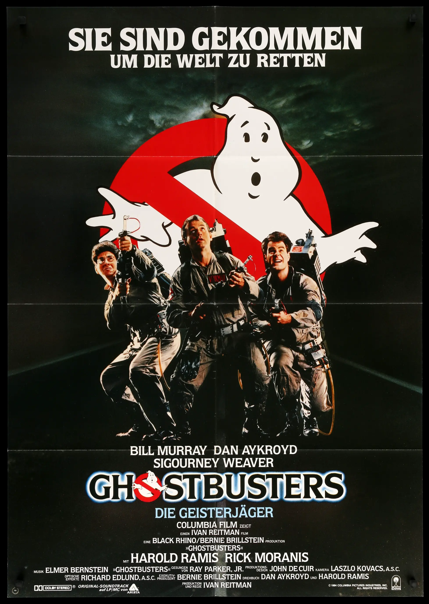
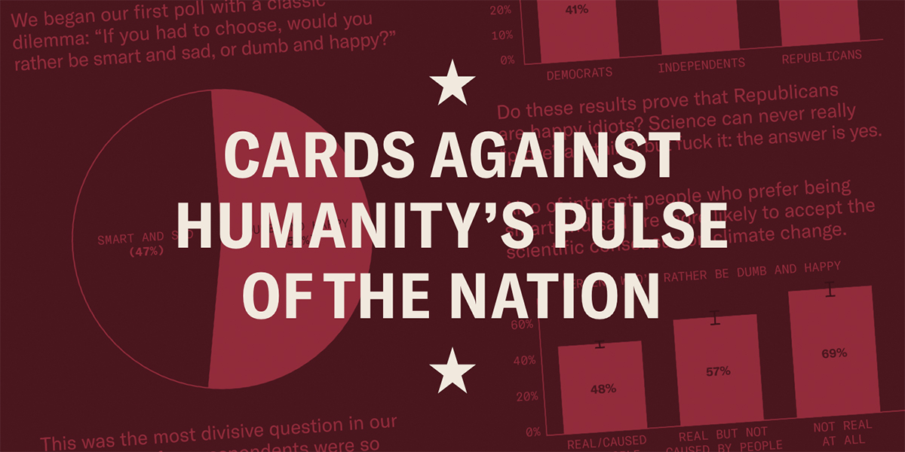
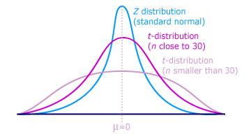
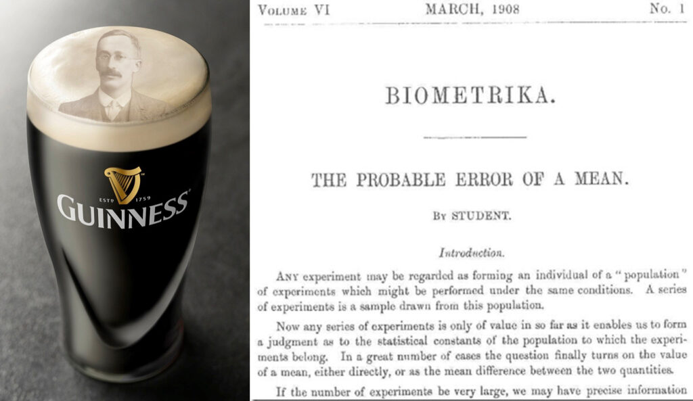
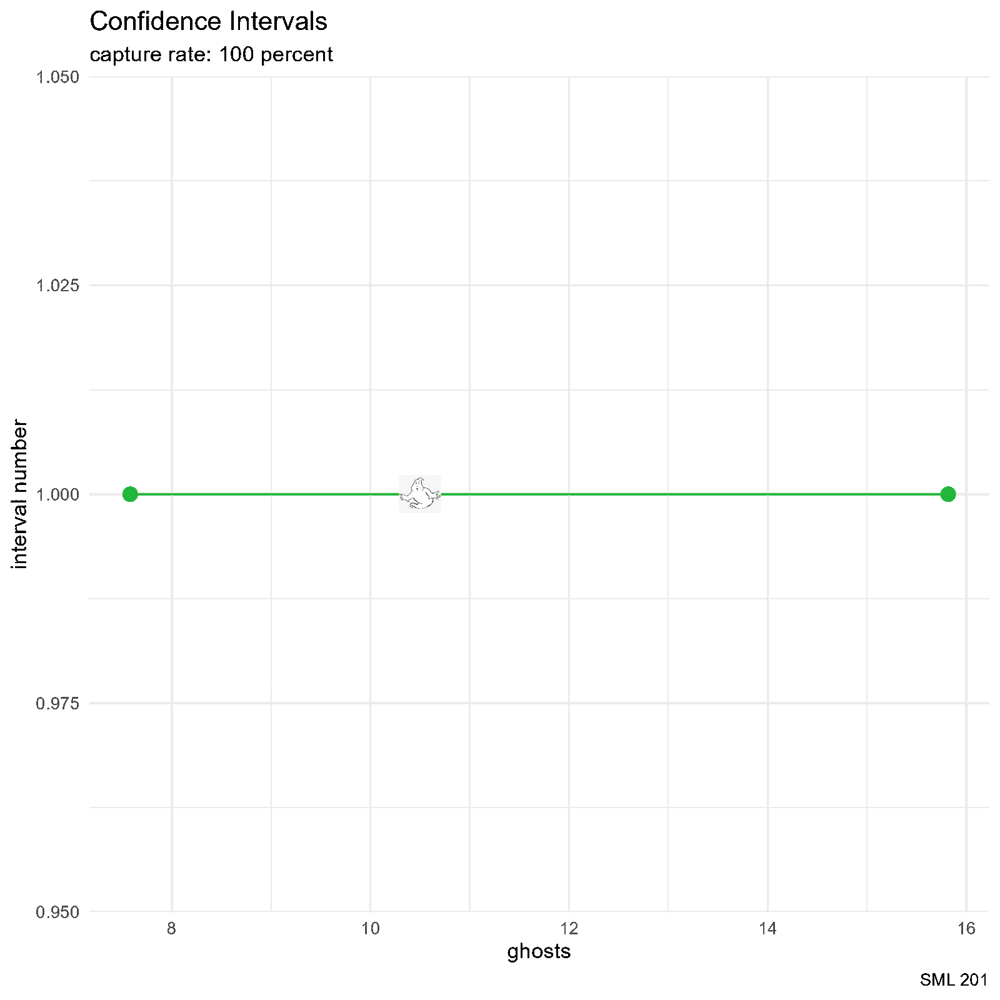
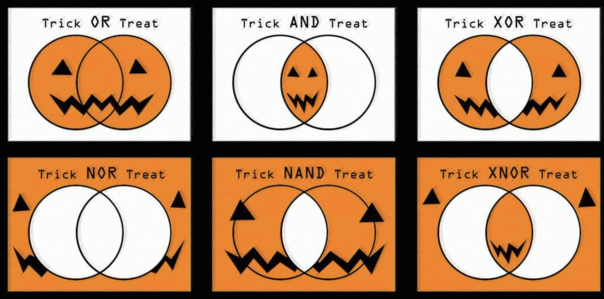

# SML 201

::: {.callout-note collapse="true"}
## Libraries and Helper Functions

```{r}
#| message: false
#| warning: false
library("bayesrules") #data set: Pulse of the Nation
library("ggimage")    #customize images for scatterpoint points
library("ggtext")     #adorn ggplot text
library("gt")         #great tables
library("infer")      #streamlined code for inference tasks
library("janitor")    #compute proportions easily
library("tidyverse")  #tools for data wrangling and visualization

# school colors
princeton_orange <- "#E77500"
princeton_black  <- "#121212"

# data set: Pulse of the Nation
data(pulse_of_the_nation)
pulse_df <- pulse_of_the_nation

# data set: SML 201 demographics survey
demo_df <- readr::read_csv("demographics_data.csv")

# data set: SML 201 probability perceptions survey
prob_df <- readr::read_csv("probability_perceptions.csv")

# Derek's helper functions
source("vdist.R")
```


:::

## Start

:::: {.columns}

::: {.column width="50%"}
* **Goal**: Estimate unknown population statistics

* **Objective**: Deploy and interpret confidence intervals
:::

::: {.column width="10%"}

:::

::: {.column width="40%"}

:::

::::

# Old Methods

## Scenario: Believe in Ghosts?

::::: {.panel-tabset}

## Query

:::: {.columns}

::: {.column width="45%"}
	
:::

::: {.column width="10%"}
	
:::

::: {.column width="45%"}
What proportion of people believe that ghosts exist?
:::

::::

## Data

:::: {.columns}

::: {.column width="45%"}
* source: [Pulse of the Nation](https://thepulseofthenation.com/#intro) survey by Cards Against Humanity
* Poll 1: September 2017

* 1000 observations
* 15 variables

:::

::: {.column width="10%"}

:::

::: {.column width="45%"}

:::

::::
:::::


## Normal Distribution

:::: {.columns}

::: {.column width="45%"}
	
Walter Peck wants estimates to have at least *95 percent confidence*!

```{r}
# 2.5 and 97.5 percentiles
qnorm(c(0.025, 0.975))
```

:::

::: {.column width="10%"}
	
:::

::: {.column width="45%"}


```{r}
vnorm(qnorm(c(0.025, 0.975)), section = "between") +
  annotate("text", x = 0, y = 0.2, label = "95%", 
           color = "white", size = 15) +
  labs(title = "Extracting a 95 Percent Interval",
       x = "z") +
  scale_x_continuous(breaks = c(-1.96, 1.96),
                     labels = c(-1.96, 1.96))
```

:::

::::


## Sample Proportion

::::: {.panel-tabset}

## Display

:::: {.columns}

::: {.column width="40%"}
```{r}
#| echo: false
#| eval: true
pulse_df |>
  tabyl(ghosts) |>
  adorn_totals("row") |>
  adorn_pct_formatting()
```

$$\hat{p} = 0.379$$
$$n = 1000$$

:::

::: {.column width="10%"}
	
:::

::: {.column width="50%"}
```{r}
#| echo: false
#| eval: true

title_string <- "<span style = 'color:#23b63c'>Believes that Ghosts Exist</span><br>versus<br><span style = 'color:#ea0000'>Doesn't Believe that Ghosts Exist</span>"

pulse_df |>
  ggplot() +
  geom_bar(aes(x = ghosts, fill = ghosts)) +
  annotate("text", x = c("No", "Yes"), y = c(310, 170), 
           label = c("62%", "38%"), 
           color = "white", size = 15) +
  labs(title = title_string,
       caption = "SML 201") +
  scale_fill_manual(values = c("#ea0000", "#23b63c")) +
  theme_minimal() +
  theme(legend.position = "none",
        plot.title = element_markdown(hjust = 0.5,
                                      face = "bold",
                                      size = 20))
```

:::

::::

## Code

```{r}
#| echo: true
#| eval: false

pulse_df |>
  tabyl(ghosts) |>
  adorn_totals("row") |>
  adorn_pct_formatting()

title_string <- "<span style = 'color:#23b63c'>Believes that Ghosts Exist</span><br>versus<br><span style = 'color:#ea0000'>Doesn't Believe that Ghosts Exist</span>"

pulse_df |>
  ggplot() +
  geom_bar(aes(x = ghosts, fill = ghosts)) +
  annotate("text", x = c("No", "Yes"), y = c(310, 170), 
           label = c("62%", "38%"), 
           color = "white", size = 15) +
  labs(title = title_string,
       caption = "SML 201") +
  scale_fill_manual(values = c("#ea0000", "#23b63c")) +
  theme_minimal() +
  theme(legend.position = "none",
        plot.title = element_markdown(hjust = 0.5,
                                      face = "bold",
                                      size = 20))
```

:::::


## Confidence Interval for a Proportion

::::: {.panel-tabset}

## Math

$$\hat{p} \pm E, \quad\text{where } E = z_{\alpha/2}*\sqrt{\frac{\hat{p}(1 - \hat{p})}{n}} \text{ and } z_{\alpha/2} \approx 1.96$$

$$\left(0.3489, 0.4091\right)$$


## R

```{r}
# sample statistics
phat <- mean(pulse_df$ghosts == "Yes")
n <- sum(!is.na(pulse_df$ghosts))

# margin of error
E <- qnorm(0.975)*sqrt((phat*(1-phat))/n)

# confidence interval
phat + c(-1,1)*E
```

:::::

::: {.callout-note}
## Inference Interpretation

*We are 95 percent confident* that the **true population proportion** of Americans that believe in ghosts is in between 34.89 and 40.91 percent.
:::

::: {.callout-warning}
## DCP1
:::

## Scenario: How Old Are You?

:::: {.columns}

::: {.column width="45%"}

:::

::: {.column width="10%"}
	
:::

::: {.column width="45%"}
Among the people that believe in ghosts, how old are you?
:::

::::


::::: {.panel-tabset}

## Display

:::: {.columns}

::: {.column width="40%"}
```{r}
#| echo: false
#| eval: true

pulse_df |>
  group_by(ghosts) |>
  summarize(xbar = mean(age, na.rm = TRUE),
            n = n())
```	

$$\bar{x} \approx 47.9525$$
$$n = 379$$

:::

::: {.column width="10%"}
	
:::

::: {.column width="50%"}
```{r}
#| echo: false
#| eval: true
title_string <- "<span style = 'color:#23b63c'>Believes that Ghosts Exist</span><br>versus<br><span style = 'color:#ea0000'>Doesn't Believe that Ghosts Exist</span>"

pulse_df |>
  ggplot() +
  geom_density(aes(x = age, fill = ghosts),
               alpha = 0.5) +
  labs(title = title_string,
       caption = "SML 201") +
  scale_fill_manual(values = c("#ea0000", "#23b63c")) +
  theme_minimal() +
  theme(legend.position = "none",
        plot.title = element_markdown(hjust = 0.5,
                                      face = "bold",
                                      size = 20))
```

:::

::::

## Code

```{r}
#| echo: true
#| eval: false

pulse_df |>
  group_by(ghosts) |>
  summarize(xbar = mean(age, na.rm = TRUE),
            n = n())

title_string <- "<span style = 'color:#23b63c'>Believes that Ghosts Exist</span><br>versus<br><span style = 'color:#ea0000'>Doesn't Believe that Ghosts Exist</span>"

pulse_df |>
  ggplot() +
  geom_density(aes(x = age, fill = ghosts),
               alpha = 0.5) +
  labs(title = title_string,
       caption = "SML 201") +
  scale_fill_manual(values = c("#ea0000", "#23b63c")) +
  theme_minimal() +
  theme(legend.position = "none",
        plot.title = element_markdown(hjust = 0.5,
                                      face = "bold",
                                      size = 20))
```

:::::


## Confidence Interval for a Mean

::::: {.panel-tabset}

## Math

$$\bar{x} \pm E, \quad\text{where } E = t_{\alpha/2}*\frac{s}{\sqrt{n}}$$

$$\left(46.3651, 49.5399\right)$$

*We are 95 percent confident* that the **true population mean** age for people that believe ghosts exist is in between 46.37 and 49.54 years old.

## R

```{r}
# subset
ghosts_yes <- pulse_df |> filter(ghosts == "Yes")

# sample statistics
xbar <- mean(ghosts_yes$age, na.rm = TRUE)
s <- sd(ghosts_yes$age, na.rm = TRUE)
n <- sum(!is.na(ghosts_yes$age))

# margin of error (here: "df" are degrees of freedom)
E <- qt(0.975, df = n - 1)*s/sqrt(n)

# confidence interval
xbar + c(-1,1)*E
```

::: {.callout-note}
## Inference Interpretation

*We are 95 percent confident* that the **true population mean** age for people that believe ghosts exist is in between 46.37 and 49.54 years old.
:::


:::::

## Student t Distribution

::::: {.panel-tabset}

## Idea

The **Student t distribution** is an abstraction of the standard normal distribution that adjusts with wider tails to allow for more probability in the tails



## Gosset



## df

In advanced statistics, such as the adjusted $R^{2}$ calculation for the coefficient of determination, the **degrees of freedom** are the difference between

* number of observations in the data
* number of independent variables being modeled

For this setting---estimating the true population mean---the degrees of freedom are simply

$$df = n - 1$$
:::::

::: {.callout-warning}
## Leaving the t distribution behind

For these calculations

$$\bar{x} \pm E, \quad\text{where } E = t_{\alpha/2}*\frac{s}{n}$$

* rely more on *summary statistics* rather than all of the gathered data
* "degrees of freedom" is a rather convoluted notion
* t-distribution is itself an approximation
* leads to more reliance on abstract probability distributions
* departs from frequentist probability philosophy
* more useful before calculators and computers
:::


# Modern Methods

::: {.callout-tip}
## infer

The developers of the `infer` package (and similar in other programming languages) streamlined coding syntax for these statistical tasks

* eases programming
* leverages *simulations*
:::


## Scenario: Princeton Politics

The survey question was

> On a scale of 0 to 100---with 0 = Democrat and 100 = Republican---where are your political leanings? 

### Bootstrap Distribution

```{r}
set.seed(201)
bootstrap_distribution <- demo_df |>
  specify(response = politics) |>
  generate(reps = 1000, type = "bootstrap") |>
  calculate(stat = "mean")
```

### Endpoints (Standard Error)

```{r}
xbar <- mean(demo_df$politics, na.rm = TRUE)
se_ci <- bootstrap_distribution |>
  get_confidence_interval(level = 0.95,
                          type = "se", 
                          point_estimate = xbar)
```

### Visualization

```{r}
bootstrap_distribution |>
  visualize() +
  shade_confidence_interval(endpoints = se_ci,
                            color = princeton_black,
                            fill = princeton_orange) +
  labs(title = "Political Leanings of Princeton Students",
       subtitle = "Spring 2026",
       caption = "SML 201",
       x = "0: Democrat ... 100: Republican") +
  theme_minimal() +
  xlim(0, 100)
```

### Inference

```{r}
print(round(se_ci))
```

In this survey question, "On a scale of 0 to 100---with 0 = Democrat and 100 = Republican---where are your political leanings?", *we are 95 percent confident* that the true population mean for Princeton students is in between 26 and 35.

::: {.callout-caution}
### Discussion

This was a survey among SML 201 students

* not a representative or random sample of Princeton students
* self-reported data
:::

::: {.callout-warning}
## DCP2
:::

## Scenario: Pineapple on Pizza

The sample proportions (among those who were adamant) were

```{r}
demo_df |>
  filter(pineapple_pizza %in% c("No!", "Yes!")) |>
  tabyl(pineapple_pizza) |>
  adorn_totals("row") |>
  adorn_pct_formatting()
```

### Bootstrap Distribution

```{r}
set.seed(201)
bootstrap_distribution <- demo_df |>
  
  # make into factor (categorical) variable if need be
  # mutate(pineapple_pizza = factor(pineapple_pizza)) |>
  
  filter(pineapple_pizza %in% c("No!", "Yes!")) |>
  specify(response = pineapple_pizza, success= "Yes!") |>
  generate(reps = 1000, type = "bootstrap") |>
  calculate(stat = "prop")
```

### Endpoints (Percentile)

Building the confidence interval from percentiles is perhaps more reasonable than using the standard errors (and less code too).

```{r}
per_ci <- bootstrap_distribution |>
  get_ci(level = 0.95, type = "percentile")
```

### Visualization

```{r}
bootstrap_distribution |>
  visualize() +
  shade_ci(per_ci, 
           color = princeton_black, fill = princeton_orange)
```

### Inference

```{r}
bootstrap_distribution |> get_ci()
# default settings: 95% confidence, percentile method
```

::: {.callout-note}
### Inference Interpretation

Among the Princeton students who have a strong opinion on whether or not pineapple is a good pizza topping, *we are 95 percent confident* that the *true population proportion* of students who like pineapple on pizza is in between 44 and 63 percent. 
:::


::: {.callout-caution}
### Discussion

This was a survey among SML 201 students

* relatively smaller sample size ($n = 106$ students had a stated preference)
* Since 0.5 is contained within the confidence interval, this result is not significally different than simply flipping a fair coin.
:::


# Theory

:::: {.columns}

::: {.column width="45%"}

:::

::: {.column width="10%"}
	
:::

::: {.column width="45%"}
But why are we using careful language like "We are 95 percent confident ..."?
:::

::::

## Scenario: 20 Ghosts

:::: {.columns}

::: {.column width="25%"}

:::

::: {.column width="5%"}
	
:::

::: {.column width="40%"}
Remember when we faced the **Dungeon Master** and their army of 20 ghosts?  Under the equal probabilities of a uniform distribution, we knew that we would face off against $\mu = 10.5$ ghosts, on average.	
:::

::: {.column width="5%"}
	
:::

::: {.column width="25%"}

:::

::::

### Experiment

:::: {.columns}

::: {.column width="30%"}

:::

::: {.column width="10%"}
	
:::

::: {.column width="60%"}
We could *resample* the outcome space and see what proportion of confidence intervals capture the [population mean] ghost.
:::

::::

### Simulation

::::: {.panel-tabset}

#### Animation

```{r}
#| echo: false
#| eval: false
#| message: false
#| warning: false
set.seed(201)
# d20
d20_df <- data.frame(d20_outcomes = 1:20)

# create data frame and allocate space
df_for_graph <- data.frame(
  id = 1:26,
  a = rep(NA, 26),
  b = rep(NA, 26),
  result = rep(NA, 26),
  result_color = rep(NA, 26)
)

for(i in 1:26){
  # bootstrap_distribution <- d20_df |>
  #   specify(response = d20_outcomes) |>
  #   generate(reps = 50, type = "bootstrap") |>
  #   calculate(stat = "mean")
  # CI <- bootstrap_distribution |> get_ci()
  
  this_sample <- sample(1:20, size = 10, replace = TRUE)
  xbar <- mean(this_sample)
  s <- sd(this_sample)
  n <- length(this_sample)
  E <- qt(0.975, df = n-1)*s/sqrt(n)
  
  
  # df_for_graph$a[i] <- unlist(CI[1])
  # df_for_graph$b[i] <- unlist(CI[2])
  df_for_graph$a[i] <- xbar - E
  df_for_graph$b[i] <- xbar + E
  df_for_graph$result[i] <- ifelse(
    df_for_graph$a[i] < 10.5 & 10.5 < df_for_graph$b[i],
    "captured",
    "not captured"
  )
  df_for_graph$result_color[i] <- ifelse(
    df_for_graph$a[i] < 10.5 & 10.5 < df_for_graph$b[i],
    "#23b63c",
    "#ea0000"
  )
  
  capture_rate <- mean(df_for_graph$result == "captured",
                       na.rm = TRUE)
  
  this_plot <- df_for_graph |>
    filter(id %in% 1:i) |>
    ggplot() +
    # geom_vline(aes(xintercept = 10.5), 
    #            color = "#ab9f8f", linewidth = 2) +
    geom_segment(aes(x = a, y = id, 
                     xend = b, yend = id,
                     color = result_color)) +
    geom_point(aes(x = a, y = id, color = result_color),
               size = 3) +
    geom_point(aes(x = b, y = id, color = result_color),
               size = 3) +
    geom_image(aes(x = 10.5, y = id),
               image = "ghostbusters_ghost.png") +
    labs(title = "Confidence Intervals",
         subtitle = paste0("capture rate: ",
                           round(100*capture_rate, 2),
                           " percent"),
         caption = "SML 201",
         x = "ghosts", y = "interval number") +
    scale_color_manual(values = c("#23b63c", "#ea0000")) +
    theme_minimal() +
    theme(legend.position = "none")
  
  ggsave(paste0("images/CI_plot", LETTERS[i], ".png"), this_plot)
}

png_files <- Sys.glob("images/CI_plot*.png")

gifski::gifski(
  png_files,
  "CI_animation.gif",    #output file name
  height = 1600, width = 1600, #you may change the resolution
  delay = 1/2                #seconds
)

```


#### Code

```{r}
#| echo: true
#| eval: false
#| message: false
#| warning: false
set.seed(201)
# d20
d20_df <- data.frame(d20_outcomes = 1:20)

# create data frame and allocate space
df_for_graph <- data.frame(
  id = 1:26,
  a = rep(NA, 26),
  b = rep(NA, 26),
  result = rep(NA, 26),
  result_color = rep(NA, 26)
)

for(i in 1:26){
  # bootstrap_distribution <- d20_df |>
  #   specify(response = d20_outcomes) |>
  #   generate(reps = 50, type = "bootstrap") |>
  #   calculate(stat = "mean")
  # CI <- bootstrap_distribution |> get_ci()
  
  this_sample <- sample(1:20, size = 10, replace = TRUE)
  xbar <- mean(this_sample)
  s <- sd(this_sample)
  n <- length(this_sample)
  E <- qt(0.975, df = n-1)*s/sqrt(n)
  
  
  # df_for_graph$a[i] <- unlist(CI[1])
  # df_for_graph$b[i] <- unlist(CI[2])
  df_for_graph$a[i] <- xbar - E
  df_for_graph$b[i] <- xbar + E
  df_for_graph$result[i] <- ifelse(
    df_for_graph$a[i] < 10.5 & 10.5 < df_for_graph$b[i],
    "captured",
    "not captured"
  )
  df_for_graph$result_color[i] <- ifelse(
    df_for_graph$a[i] < 10.5 & 10.5 < df_for_graph$b[i],
    "#23b63c",
    "#ea0000"
  )
  
  capture_rate <- mean(df_for_graph$result == "captured",
                       na.rm = TRUE)
  
  this_plot <- df_for_graph |>
    filter(id %in% 1:i) |>
    ggplot() +
    # geom_vline(aes(xintercept = 10.5), 
    #            color = "#ab9f8f", linewidth = 2) +
    geom_segment(aes(x = a, y = id, 
                     xend = b, yend = id,
                     color = result_color)) +
    geom_point(aes(x = a, y = id, color = result_color),
               size = 3) +
    geom_point(aes(x = b, y = id, color = result_color),
               size = 3) +
    geom_image(aes(x = 10.5, y = id),
               image = "ghostbusters_ghost.png") +
    labs(title = "Confidence Intervals",
         subtitle = paste0("capture rate: ",
                           round(100*capture_rate, 2),
                           " percent"),
         caption = "SML 201",
         x = "ghosts", y = "interval number") +
    scale_color_manual(values = c("#23b63c", "#ea0000")) +
    theme_minimal() +
    theme(legend.position = "none")
  
  ggsave(paste0("images/CI_plot", LETTERS[i], ".png"), this_plot)
}

png_files <- Sys.glob("images/CI_plot*.png")

gifski::gifski(
  png_files,
  "CI_animation.gif",    #output file name
  height = 1600, width = 1600, #you may change the resolution
  delay = 1/2                #seconds
)

```

:::::

::: {.callout-warning}
## DCP3
:::

# Probability Perceptions

:::: {.columns}

::: {.column width="45%"}

:::::: {style="font-size: 1.5em;"}
We filled out a survey to judge the following terms on the scale from zero to 100 percent.	
::::::

:::

::: {.column width="10%"}
	
:::

::: {.column width="45%"}
* certainly
* frequently
* likely
* maybe
* never
* often
* rarely
* possibly
* probably
* unlikely
:::

::::

::: {.callout-tip}
## Pivot Tables

There are times when making a **pivot table** eases upcoming calculations. The resultant table may be arranged to be wider or longer.

* long: more rows and fewer columns
* wide: more columns and fewer rows
:::

## Three Words

### subset

:::: {.columns}

::: {.column width="45%"}

:::::: {style="font-size: 1.25em;"}
To ease understanding of this concept, let us look at just a small subset of the data.
::::::
	
:::

::: {.column width="10%"}
	
:::

::: {.column width="45%"}
```{r}
prob_wide <- prob_df |>
  select(rarely, likely, frequently) |>
  slice(1:5)
```

:::

::::

### wide

```{r}
#| echo: false

prob_wide |>
  gt() |>
  cols_align(align = "center") |>
  tab_footnote(footnote = "SML 201") |>
  tab_header(
    title = "Probability Perceptions",
    subtitle = "wide table"
  ) |>
  tab_style(
    style = cell_text(weight = "bold"),
    locations = cells_column_labels()
  ) |>
  tab_style(
    style = cell_fill(color = "tomato1"),
    locations = cells_body(columns = rarely)
  ) |>
  tab_style(
    style = cell_fill(color = "purple1"),
    locations = cells_body(columns = likely)
  ) |>
  tab_style(
    style = cell_fill(color = "skyblue1"),
    locations = cells_body(columns = frequently)
  )
```

### pivot

```{r}
prob_tall <- prob_wide |>
  pivot_longer(
    cols = everything(),  #column selection
    names_to = "term",    #categorical labels
    values_to = "percent" #numerical values
  )
```

### tall

```{r}
#| echo: false
#| 
prob_tall |>
  gt() |>
  cols_align(align = "center") |>
  tab_footnote(footnote = "SML 201") |>
  tab_header(
    title = "Probability Perceptions",
    subtitle = "tall table"
  ) |>
  tab_style(
    style = cell_text(weight = "bold"),
    locations = cells_column_labels()
  ) |>
  tab_style(
    style = cell_fill(color = "tomato1"),
    locations = cells_body(rows = term == "rarely")
  ) |>
  tab_style(
    style = cell_fill(color = "purple1"),
    locations = cells_body(rows = term == "likely")
  ) |>
  tab_style(
    style = cell_fill(color = "skyblue1"),
    locations = cells_body(rows = term == "frequently")
  )
```

### juxtaposed

::::: {.panel-tabset}

#### tables

:::: {.columns}

::: {.column width="45%"}
```{r}
#| echo: false

prob_wide |>
  gt() |>
  cols_align(align = "center") |>
  tab_footnote(footnote = "SML 201") |>
  tab_header(
    title = "Probability Perceptions",
    subtitle = "wide table"
  ) |>
  tab_style(
    style = cell_text(weight = "bold"),
    locations = cells_column_labels()
  ) |>
  tab_style(
    style = cell_fill(color = "tomato1"),
    locations = cells_body(columns = rarely)
  ) |>
  tab_style(
    style = cell_fill(color = "purple1"),
    locations = cells_body(columns = likely)
  ) |>
  tab_style(
    style = cell_fill(color = "skyblue1"),
    locations = cells_body(columns = frequently)
  )
```	
:::

::: {.column width="10%"}
	
:::

::: {.column width="45%"}
```{r}
#| echo: false
#| 
prob_tall |>
  gt() |>
  cols_align(align = "center") |>
  tab_footnote(footnote = "SML 201") |>
  tab_header(
    title = "Probability Perceptions",
    subtitle = "tall table"
  ) |>
  tab_style(
    style = cell_text(weight = "bold"),
    locations = cells_column_labels()
  ) |>
  tab_style(
    style = cell_fill(color = "tomato1"),
    locations = cells_body(rows = term == "rarely")
  ) |>
  tab_style(
    style = cell_fill(color = "purple1"),
    locations = cells_body(rows = term == "likely")
  ) |>
  tab_style(
    style = cell_fill(color = "skyblue1"),
    locations = cells_body(rows = term == "frequently")
  )
```
:::

::::

#### gt

```{r}
#| eval: false

prob_wide |>
  gt() |>
  cols_align(align = "center") |>
  tab_footnote(footnote = "SML 201") |>
  tab_header(
    title = "Probability Perceptions",
    subtitle = "wide table"
  ) |>
  tab_style(
    style = cell_text(weight = "bold"),
    locations = cells_column_labels()
  ) |>
  tab_style(
    style = cell_fill(color = "tomato1"),
    locations = cells_body(columns = rarely)
  ) |>
  tab_style(
    style = cell_fill(color = "purple1"),
    locations = cells_body(columns = likely)
  ) |>
  tab_style(
    style = cell_fill(color = "skyblue1"),
    locations = cells_body(columns = frequently)
  )
```	

```{r}
#| eval: false
#| 
prob_tall |>
  gt() |>
  cols_align(align = "center") |>
  tab_footnote(footnote = "SML 201") |>
  tab_header(
    title = "Probability Perceptions",
    subtitle = "tall table"
  ) |>
  tab_style(
    style = cell_text(weight = "bold"),
    locations = cells_column_labels()
  ) |>
  tab_style(
    style = cell_fill(color = "tomato1"),
    locations = cells_body(rows = term == "rarely")
  ) |>
  tab_style(
    style = cell_fill(color = "purple1"),
    locations = cells_body(rows = term == "likely")
  ) |>
  tab_style(
    style = cell_fill(color = "skyblue1"),
    locations = cells_body(rows = term == "frequently")
  )
```

:::::

### plotting

::::: {.panel-tabset}

#### density

```{r}
#| echo: false

prob_tall |>
  ggplot() +
  geom_density(aes(x = percent, fill = term),
               alpha = 0.201) +
  labs(title = "Probability Perceptions",
       subtitle = "density plot",
       caption = "SML 201") +
  scale_fill_manual(values = c("skyblue1", "purple1", "tomato1")) +
  theme_minimal()
```

#### code

```{r}
#| eval: false

prob_tall |>
  ggplot() +
  geom_density(aes(x = percent, fill = term),
               alpha = 0.201) +
  labs(title = "Probability Perceptions",
       subtitle = "density plot",
       caption = "SML 201") +
  scale_fill_manual(values = c("skyblue1", "purple1", "tomato1")) +
  theme_minimal()
```

:::::

### reversion

```{r}
#| eval: false

prob_wide <- prob_tall |>
  mutate(id = rep(1:5, each = 3)) |>
  pivot_wider(id_cols = id,
              names_from = term,
              values_from = percent)
```


## Nine Words

::::: {.panel-tabset}

### ranking

```{r}
#| echo: false
prob_long <- prob_df |>
  pivot_longer(cols = everything(),
    names_to = "term", 
    values_to = "percent")

prob_long |> 
  group_by(term) |> 
  summarize(q25 = quantile(percent, 0.25, na.rm = TRUE),
            median = median(percent, na.rm = TRUE),
            q75 = quantile(percent, 0.75, na.rm = TRUE)) |>
  arrange(median, q25, q75)
```

### boxplots

```{r}
#| echo: false
#| warning: false
prob_long |>
  group_by(term) |>
  mutate(median = median(percent, na.rm = TRUE)) |>
  ungroup() |>
  ggplot() +
  geom_boxplot(aes(x = percent, 
                   y = fct_reorder(term, median),
                   color = term)) +
  labs(title = "Perceptions of Probability",
       subtitle = "Spring 2026 Semester",
       caption = "SML 201",
       x = "percent", y = "") +
  theme_minimal() +
  theme(legend.position = "none")
```

### codes

```{r}
#| eval: false
prob_long <- prob_df |>
  pivot_longer(cols = everything(),
    names_to = "term", 
    values_to = "percent")

prob_long |> 
  group_by(term) |> 
  summarize(q25 = quantile(percent, 0.25, na.rm = TRUE),
            median = median(percent, na.rm = TRUE),
            q75 = quantile(percent, 0.75, na.rm = TRUE)) |>
  arrange(median, q25, q75)
```

```{r}
#| eval: false
#| warning: false
prob_long |>
  group_by(term) |>
  mutate(median = median(percent, na.rm = TRUE)) |>
  ungroup() |>
  ggplot() +
  geom_boxplot(aes(x = percent, 
                   y = fct_reorder(term, median),
                   color = term)) +
  labs(title = "Perceptions of Probability",
       subtitle = "Spring 2026 Semester",
       caption = "SML 201",
       x = "percent", y = "") +
  theme_minimal() +
  theme(legend.position = "none")
```

:::::


# Quo Vadimus?

:::: {.columns}

::: {.column width="40%"}

* Due Friday (March 27)
  * Precept 7
  * Read Chapter 9 (quiz)

* Project 2 (due April 7)
* Exam 2 (April 23)
:::

::: {.column width="10%"}
	
:::

::: {.column width="50%"}


:::

::::


# Footnotes

::: {.callout-note collapse="true"}
## (optional) Additional Resources


:::

::: {.callout-note collapse="true"}
## Session Info

```{r}
sessionInfo()
```
:::


:::: {.columns}

::: {.column width="45%"}
	
:::

::: {.column width="10%"}
	
:::

::: {.column width="45%"}

:::

::::

::::: {.panel-tabset}


:::::