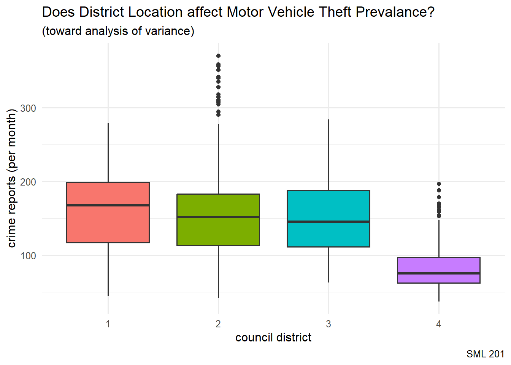
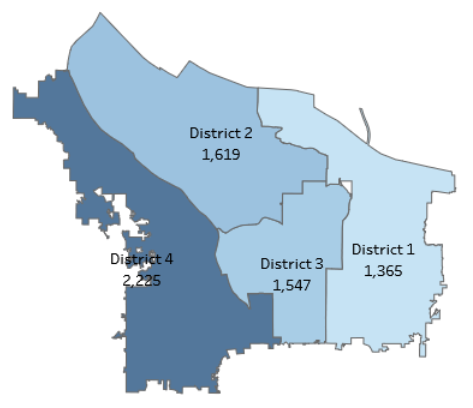
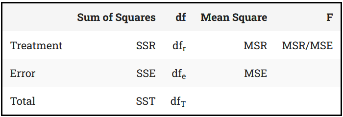
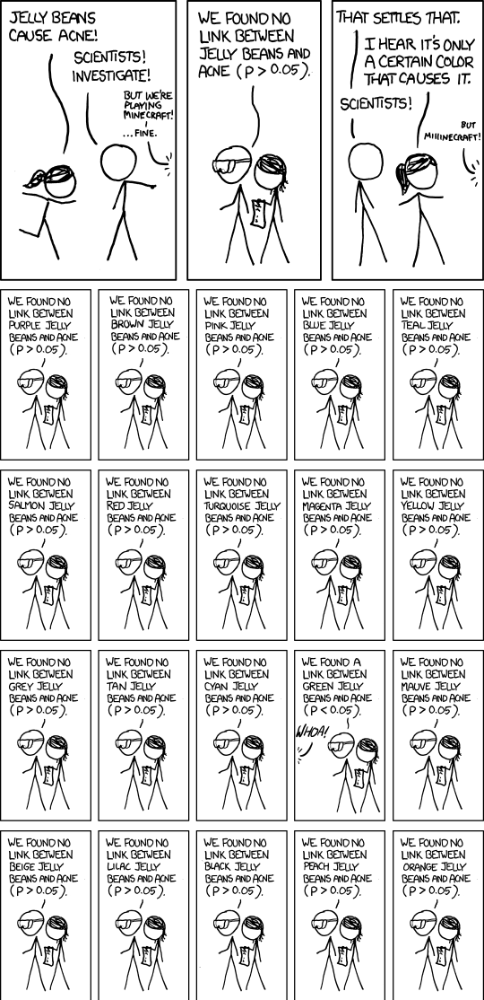

# SML 201

## Start

:::: {.columns}

::: {.column width="50%"}
* **Goal**: Explore analysis of variance to compare more than two groups

* **Objectives**: Discuss ANOVA and p-hacking
:::

::: {.column width="10%"}

:::

::: {.column width="40%"}

:::

::::

::: {.callout-note collapse="true"}
## Libraries and Helper Functions

```{r}
#| message: false
#| warning: false

library("ggsignif")   #put significance "stars" on boxplots
library("infer")      #pipeline workflow for hypothesis testing
library("janitor")    #compute proportions easily
library("moderndive") #textbook's package and data
library("patchwork")  #easily let's me show graphs side-by-side
library("tidyverse")  #the overall programming style universe

# school colors
princeton_orange <- "#E77500"
princeton_black  <- "#121212"

# data set: Portland Crime Data
offense_cat <- readr::read_csv("offense_cat.csv")
# victim_cat  <- readr::read_csv("victim_cat.csv")

```

:::

# Case Study: Portland Crime Data

::::: {.panel-tabset}

## overview

"The Monthly Reported Crime Statistics is an interactive data visualization of the offenses reported to the Portland Police Bureau. This report is built to provide custom analyses of the reported crime data to interested members of the community, especially as it relates to the Portland neighborhoods and council districts." 

* [https://www.portland.gov/police/open-data/reported-crime-data](https://www.portland.gov/police/open-data/reported-crime-data)

## Offenses

```{r}
#| echo: false

str(offense_cat, give.attr = FALSE)
```

## Districts



* **District 1**: suburban
* **District 4**: downtown
* Counts shown were for vandalism reports in the previous 12 months.

```{r}
crime_df <- offense_cat |>
  # removing some incomplete observations
  filter(!is.na(CouncilDistrict)) |>
  
  # treating council district as a categorical variable
  mutate(CouncilDistrict_cat = factor(CouncilDistrict)) |>

  # treating council district as a numerical variable
  mutate(CouncilDistrict_num = CouncilDistrict)
```


:::::


# Example: Arson

::: {.callout-note}
## NHST Test Type

For NHST (**null hypothesis significance testing**), when we want to compare more than two groups, we start with ANOVA (**analysis of variance**)
:::

* Colloquially: Is there a council district that experiences more cases of arson?
* Null hypothesis: All four council districts have the *same* amounts of arson reports (per month)
* Alternative hypothesis: At least one council district has a *different* amount of arson reports (per month)

$$H_{o}: \mu_{1} = \mu_{2} = \mu_{3} = \mu_{4}$$

## Sample Statistics

```{r}
crime_df |>
  filter(OffenseCategory == "Arson") |>
  group_by(CouncilDistrict) |>
  summarize(xbar = mean(CrimeCount, na.rm = TRUE),
            s = sd(CrimeCount, na.rm = TRUE))
```

## Boxplot

```{r}
crime_df |>
  filter(OffenseCategory == "Arson") |>
  ggplot(aes(x = CouncilDistrict_cat, 
             y = CrimeCount,
             fill = CouncilDistrict_cat)) +
  geom_boxplot() +
  labs(title = "Does District Location affect Arson Prevalance?",
       subtitle = "(toward analysis of variance)",
       caption = "SML 201",
       x = "council district", y = "crime reports (per month)") +
  theme_minimal(base_size = 16) +
  theme(legend.position = "none")
```

::: {.callout-tip collapse="true"}
## Intuition

The boxplot visualization lets us guess at whether or not the means for multiple groups are *significantly* different (or not).
:::

::: {.callout-note collapse="true"}
### What if we used a numerical variable?

We turned the explanatory variable into a **factor variable** here in `R` so that it would be treated as a categorical variable.  If we had left that as a numerical variable

```{r}
crime_df |>
  filter(OffenseCategory == "Arson") |>
  ggplot(aes(x = CouncilDistrict_num, 
             y = CrimeCount,
             fill = CouncilDistrict_num,
             group = CouncilDistrict_num)) +
  geom_boxplot() +
  labs(title = "Does District Location affect Arson Prevalance?",
       subtitle = "(toward analysis of variance)",
       caption = "SML 201",
       x = "council district", y = "crime reports (per month)") +
  theme_minimal(base_size = 14)
```
:::


# Modern Approach (infer)

## Null Distribution

In the modern approach, with the `infer` code package, we build a null distribution (i.e. all four council districts have the *same* amounts of arson reports (per month)).

* [Using infer for ANOVA](https://infer.tidymodels.org/articles/anova.html)

::: {.callout-note collapse="true"}
## Permutation Test

If the district location here did not affect the number of arson reports, then it shouldn't matter if we permute the council district  labels.
:::

```{r}
# First, generate the null distribution
set.seed(201)
null_distribution <- crime_df |>
  filter(OffenseCategory == "Arson") |>
  specify(CrimeCount ~ CouncilDistrict_cat) |>
  hypothesize(null = "independence") |>
  generate(reps = 1000, type = "permute") |>
  calculate(stat = "F")
#F distribution explained later in lecture
#specify(reponse = CrimeCount, explanatory = CouncilDistrict_cat)
```

```{r}
# Second, compute the observed F statistic
obs_f_stat <- crime_df |>
  filter(OffenseCategory == "Arson") |>
  specify(CrimeCount ~ CouncilDistrict_cat) |>
  # hypothesize(null = "independence") |>
  # generate(reps = 1000, type = "permute") |>
  calculate(stat = "F")
```

```{r}
# Third, visualize the F distribution and p-value
null_distribution |>
  visualize(method = "both") + 
  shade_p_value(obs_f_stat,
                direction = "greater")
```

```{r}
# Fourth, compute the p-value directly 
# always use "greater" with ANOVA and its F distribution
null_distribution |>
  get_p_value(obs_f_stat,
                direction = "greater")
```


::: {.callout-warning}
## Inconclusive

Since the p-value > 0.05, we have *failed to reject the null hypothesis* that all four council districts have the *same* amounts of arson reports (per month) (at the $\alpha = 0.05$ significance level).

We may treat this result as inconclusive or note that we have not found evidence here toward showing that district location affects prevalence of arson.
:::

::: {.callout-warning}
## DCP1
:::

# Old Method (F Distribution)



* image source: [Kent State library guides](https://libguides.library.kent.edu/spss/onewayanova)

## parameters

```{r}
# sample size
n <- crime_df |>
  filter(OffenseCategory == "Arson") |>
  count(OffenseCategory) |>
  pull(n)

# number of groups
k <- crime_df |>
  summarize(num_groups = n_distinct(CouncilDistrict)) |>
  pull(num_groups)
```

## degrees of freedom

```{r}
# model degrees of freedom (explained variation)
df_r <- k - 1

# error degrees of freedom (unexplained variation)
df_e <- n - k

# total degrees of freedom (df_r + df_e)
df_t <- n - 1
```

## sum of squares

```{r}
#| echo: false

anova_model <- summary(aov(CrimeCount ~ CouncilDistrict_cat,
                           data = crime_df |>
                             filter(OffenseCategory == "Arson")))[[1]]

SSE_df <- crime_df |>
  filter(OffenseCategory == "Arson") |>
  select(CouncilDistrict_cat, CouncilDistrict_num, CrimeCount) |>
  mutate(overall_mean = mean(CrimeCount)) |>
  group_by(CouncilDistrict_cat) |>
  mutate(group_means = mean(CrimeCount)) |>
  ungroup()

set.seed(201)
SSE_df_for_graph <- SSE_df |>
  filter(CrimeCount <= 15) |>
  mutate(x = CouncilDistrict_num + rnorm(n(),0,0.15)) |>
  group_by(CouncilDistrict_cat) |>
  mutate(min_x = min(x),
         max_x = max(x)) |>
  ungroup()

mu_total <- SSE_df_for_graph |>
  distinct(overall_mean) |>
  pull(overall_mean)
# mu_1 <- SSE_df_for_graph |>
#   filter(CouncilDistrict_cat == 1) |>
#   distinct(group_means) |> pull(group_means)
# mu_2 <- SSE_df_for_graph |>
#   filter(CouncilDistrict_cat == 2) |>
#   distinct(group_means) |> pull(group_means)
# mu_3 <- SSE_df_for_graph |>
#   filter(CouncilDistrict_cat == 3) |>
#   distinct(group_means) |> pull(group_means)
# mu_4 <- SSE_df_for_graph |>
#   filter(CouncilDistrict_cat == 4) |>
#   distinct(group_means) |> pull(group_means)

group_segments <- SSE_df_for_graph |>
  select(-c(CouncilDistrict_num, CrimeCount, x)) |>
  distinct()

plot_jitter <- SSE_df_for_graph |>
  ggplot() +
  geom_point(aes(x = x, y = CrimeCount, 
                 color = CouncilDistrict_cat)) +
  labs(title = "Toward Analysis of Variance",
       subtitle = "original data",
       caption = "SML 201",
       x = "council district", y = "crime reports (per month)") +
  theme_minimal() +
  theme(legend.position = "none")

plot_SSR <- SSE_df_for_graph |>
  ggplot() +
  geom_segment(aes(x = x, y = overall_mean,
                   xend = x, yend = group_means,
                   color = CouncilDistrict_cat)) +
  geom_point(aes(x = x, y = CrimeCount, 
                 color = CouncilDistrict_cat),
             alpha = 0.5) +
  geom_hline(yintercept = mu_total, color = "black",
             linewidth = 2) +
  
  geom_segment(aes(x = min_x, y = group_means,
                   xend = max_x, yend = group_means,
                   color = CouncilDistrict_cat),
               data = group_segments,
               linewidth = 2) +
  
  labs(title = "SSR (Between Groups)",
       subtitle = paste0("SSR: ", round(anova_model["CouncilDistrict_cat", "Sum Sq"], 4),
                         ", df_r: ", anova_model["CouncilDistrict_cat", "Df"]),
       caption = "SML 201",
       x = "council district", y = "crime reports (per month)") +
  theme_minimal() +
  theme(legend.position = "none")
  
plot_SSE <- SSE_df_for_graph |>
  ggplot() +
  geom_segment(aes(x = x, y = CrimeCount,
                   xend = x, yend = group_means,
                   color = CouncilDistrict_cat)) +
  geom_point(aes(x = x, y = CrimeCount, 
                 color = CouncilDistrict_cat),
             alpha = 0.5) +
  # geom_hline(yintercept = mu_total, color = "black",
             # linewidth = 2) +
  
  geom_segment(aes(x = min_x, y = group_means,
                   xend = max_x, yend = group_means,
                   color = CouncilDistrict_cat),
               data = group_segments,
               linewidth = 2) +
  
  labs(title = "SSE (Within Groups)",
       subtitle = paste0("SSR: ", round(anova_model["Residuals", "Sum Sq"], 4),
                         ", df_r: ", anova_model["Residuals", "Df"]),
       caption = "SML 201",
       x = "council district", y = "crime reports (per month)") +
  theme_minimal() +
  theme(legend.position = "none")  

plot_SST <- SSE_df_for_graph |>
  ggplot() +
  geom_segment(aes(x = x, y = CrimeCount,
                   xend = x, yend = overall_mean,
                   color = CouncilDistrict_cat)) +
  geom_point(aes(x = x, y = CrimeCount, 
                 color = CouncilDistrict_cat),
             alpha = 0.5) +
  geom_hline(yintercept = mu_total, color = "black",
  linewidth = 2) +
  
  # geom_segment(aes(x = min_x, y = group_means,
  #                  xend = max_x, yend = group_means,
  #                  color = CouncilDistrict_cat),
  #              data = group_segments,
  #              linewidth = 2) +
  
  labs(title = "SST (Total Variation)",
       subtitle = paste0("SSR: ", round(sum(anova_model[, "Sum Sq"], 4)),
                         ", df_r: ", sum(anova_model[, "Df"])),
       caption = "SML 201",
       x = "council district", y = "crime reports (per month)") +
  theme_minimal() +
  theme(legend.position = "none")  
```

::::: {.panel-tabset}

### scatter

```{r}
#| echo: false

plot_jitter
```

### SSR

```{r}
#| echo: false

plot_SSR
```

### SSE

```{r}
#| echo: false

plot_SSE
```

### SST

```{r}
#| echo: false

plot_SST
```

### code

```{r}
#| echo: false

anova_model <- summary(aov(CrimeCount ~ CouncilDistrict_cat,
                           data = crime_df |>
                             filter(OffenseCategory == "Arson")))[[1]]

SSE_df <- crime_df |>
  filter(OffenseCategory == "Arson") |>
  select(CouncilDistrict_cat, CouncilDistrict_num, CrimeCount) |>
  mutate(overall_mean = mean(CrimeCount)) |>
  group_by(CouncilDistrict_cat) |>
  mutate(group_means = mean(CrimeCount)) |>
  ungroup()

set.seed(201)
SSE_df_for_graph <- SSE_df |>
  filter(CrimeCount <= 15) |>
  mutate(x = CouncilDistrict_num + rnorm(n(),0,0.15)) |>
  group_by(CouncilDistrict_cat) |>
  mutate(min_x = min(x),
         max_x = max(x)) |>
  ungroup()

mu_total <- SSE_df_for_graph |>
  distinct(overall_mean) |>
  pull(overall_mean)
# mu_1 <- SSE_df_for_graph |>
#   filter(CouncilDistrict_cat == 1) |>
#   distinct(group_means) |> pull(group_means)
# mu_2 <- SSE_df_for_graph |>
#   filter(CouncilDistrict_cat == 2) |>
#   distinct(group_means) |> pull(group_means)
# mu_3 <- SSE_df_for_graph |>
#   filter(CouncilDistrict_cat == 3) |>
#   distinct(group_means) |> pull(group_means)
# mu_4 <- SSE_df_for_graph |>
#   filter(CouncilDistrict_cat == 4) |>
#   distinct(group_means) |> pull(group_means)

group_segments <- SSE_df_for_graph |>
  select(-c(CouncilDistrict_num, CrimeCount, x)) |>
  distinct()

plot_jitter <- SSE_df_for_graph |>
  ggplot() +
  geom_point(aes(x = x, y = CrimeCount, 
                 color = CouncilDistrict_cat)) +
  labs(title = "Toward Analysis of Variance",
       subtitle = "original data",
       caption = "SML 201",
       x = "council district", y = "crime reports (per month)") +
  theme_minimal() +
  theme(legend.position = "none")

plot_SSR <- SSE_df_for_graph |>
  ggplot() +
  geom_segment(aes(x = x, y = overall_mean,
                   xend = x, yend = group_means,
                   color = CouncilDistrict_cat)) +
  geom_point(aes(x = x, y = CrimeCount, 
                 color = CouncilDistrict_cat),
             alpha = 0.5) +
  geom_hline(yintercept = mu_total, color = "black",
             linewidth = 2) +
  
  geom_segment(aes(x = min_x, y = group_means,
                   xend = max_x, yend = group_means,
                   color = CouncilDistrict_cat),
               data = group_segments,
               linewidth = 2) +
  
  labs(title = "SSR (Between Groups)",
       subtitle = paste0("SSR: ", round(anova_model["CouncilDistrict_cat", "Sum Sq"], 4),
                         ", df_r: ", anova_model["CouncilDistrict_cat", "Df"]),
       caption = "SML 201",
       x = "council district", y = "crime reports (per month)") +
  theme_minimal() +
  theme(legend.position = "none")
  
plot_SSE <- SSE_df_for_graph |>
  ggplot() +
  geom_segment(aes(x = x, y = CrimeCount,
                   xend = x, yend = group_means,
                   color = CouncilDistrict_cat)) +
  geom_point(aes(x = x, y = CrimeCount, 
                 color = CouncilDistrict_cat),
             alpha = 0.5) +
  # geom_hline(yintercept = mu_total, color = "black",
             # linewidth = 2) +
  
  geom_segment(aes(x = min_x, y = group_means,
                   xend = max_x, yend = group_means,
                   color = CouncilDistrict_cat),
               data = group_segments,
               linewidth = 2) +
  
  labs(title = "SSE (Within Groups)",
       subtitle = paste0("SSR: ", round(anova_model["Residuals", "Sum Sq"], 4),
                         ", df_r: ", anova_model["Residuals", "Df"]),
       caption = "SML 201",
       x = "council district", y = "crime reports (per month)") +
  theme_minimal() +
  theme(legend.position = "none")  

plot_SST <- SSE_df_for_graph |>
  ggplot() +
  geom_segment(aes(x = x, y = CrimeCount,
                   xend = x, yend = overall_mean,
                   color = CouncilDistrict_cat)) +
  geom_point(aes(x = x, y = CrimeCount, 
                 color = CouncilDistrict_cat),
             alpha = 0.5) +
  geom_hline(yintercept = mu_total, color = "black",
  linewidth = 2) +
  
  # geom_segment(aes(x = min_x, y = group_means,
  #                  xend = max_x, yend = group_means,
  #                  color = CouncilDistrict_cat),
  #              data = group_segments,
  #              linewidth = 2) +
  
  labs(title = "SST (Total Variation)",
       subtitle = paste0("SSR: ", round(sum(anova_model[, "Sum Sq"], 4)),
                         ", df_r: ", sum(anova_model[, "Df"])),
       caption = "SML 201",
       x = "council district", y = "crime reports (per month)") +
  theme_minimal() +
  theme(legend.position = "none")  
```

:::::

## F Distribution

::: {.callout-note collapse="true"}
### History

The **F-Distribution** (or F-Ratio) was developed by Ronald Fisher and George W Snedecor to *compare variances*.
:::

$$F = \frac{MSR}{MSE} = \frac{ \frac{SSR} {df_r} }{ \frac{SSE} {df_e} } = \frac{ \frac{\sum_{i=1}^{k} n_{i}(\bar{y}_{i} - \bar{y})} {df_r} }{ \frac{\sum_{i=1}^{k}\sum_{j=1}^{n_{i}} (y_{ij} - \bar{y}_{i})} {df_e} } = \frac{ \frac{55.5} {4-1} }{ \frac{13046.4} {528-4} } = \frac{18.516}{24.898} = 0.7437$$

## ANOVA Table

```{r}
summary(aov(CrimeCount ~ CouncilDistrict_cat,
                           data = crime_df |>
                             filter(OffenseCategory == "Arson")))[[1]]
```

## p-value

From the F-distribution, the p-value would be computed as the area in the right tail.

```{r}
pf(0.7437, 3, 524, lower.tail = FALSE)
```


::: {.callout-warning}
## DCP2
:::


# Example 2

```{r}
unique(crime_df$OffenseCategory)
```

```{r}
this_crime <- "Motor Vehicle Theft"
```


* Colloquially: Is there a council district that experiences more cases of [this crime]?
* Null hypothesis: All four council districts have the *same* amounts of [this crime] reports (per month)
* Alternative hypothesis: At least one council district has a *different* amount of [this crime] reports (per month)

$$H_{o}: \mu_{1} = \mu_{2} = \mu_{3} = \mu_{4}$$

## Sample Statistics

```{r}
crime_df |>
  filter(OffenseCategory == this_crime) |>
  group_by(CouncilDistrict) |>
  summarize(xbar = mean(CrimeCount, na.rm = TRUE),
            s = sd(CrimeCount, na.rm = TRUE))
```

## Boxplot

```{r}
crime_df |>
  filter(OffenseCategory == this_crime) |>
  ggplot(aes(x = CouncilDistrict_cat, 
             y = CrimeCount,
             fill = CouncilDistrict_cat)) +
  geom_boxplot() +
  labs(title = paste0("Does District Location affect ", this_crime,  " Prevalance?"),
       subtitle = "(toward analysis of variance)",
       caption = "SML 201",
       x = "council district", y = "crime reports (per month)") +
  theme_minimal(base_size = 12) +
  theme(legend.position = "none")
```

## Modern Approach (infer)

```{r}
# First, generate the null distribution
set.seed(20260402)
null_distribution <- crime_df |>
  filter(OffenseCategory == this_crime) |>
  specify(CrimeCount ~ CouncilDistrict_cat) |>
  hypothesize(null = "independence") |>
  generate(reps = 1000, type = "permute") |>
  calculate(stat = "F")

```

```{r}
# Second, compute the observed F statistic
obs_f_stat <- crime_df |>
  filter(OffenseCategory == this_crime) |>
  specify(CrimeCount ~ CouncilDistrict_cat) |>
  hypothesize(null = "independence") |>
  # generate(reps = 1000, type = "permute") |>
  calculate(stat = "F")
```

```{r}
#| warning: false
# Third, visualize the F distribution and p-value
null_distribution |>
  visualize(method = "both") + 
  shade_p_value(obs_f_stat,
                direction = "greater")
```

```{r}
#| warning: false
# Fourth, compute the p-value directly 
# always use "greater" with ANOVA and its F distribution
null_distribution |>
  get_p_value(obs_f_stat,
                direction = "greater")
```


::: {.callout-warning}
## DCP3
:::


# Replication Crisis


## p-hacking

:::: {.columns}

::: {.column width="70%"}
> The more statistical analyses a researcher runs—the more hypotheses they “test”—the more likely that at least one of these analyses will produce a result that appears to be “significant”, simply by chance. --- Sean Trott

* XKCD: [Significant](https://xkcd.com/882/)
* [p-hacking in R](https://seantrott.github.io/p-hacking/) by Sean Trott


	
:::

::: {.column width="10%"}
	
:::

::: {.column width="20%"}

:::

::::

## Gaussian White Noise

In this exploration, we are going to try to extract "significance" (p-value < 0.05) from Gaussian white noise

$$X, Y \sim N(\mu = 201, \sigma^{2} = 25^{2})$$

```{r}
set.seed(201)
x_vals <- rnorm(100, 201, 25)
y_vals <- rnorm(100, 201, 25) #that is, same mean
```

```{r}
cor_val <- cor(x_vals, y_vals)

data.frame(x_vals, y_vals) |>
  ggplot(aes(x = x_vals, y = y_vals)) +
  coord_equal() +
  geom_point(color = "gray50") +
  geom_smooth(formula = "y ~ x",
              method = "lm") +
  labs(title = "Gaussian White Noise",
       subtitle = paste0("Two normally distributed vectors\nwith the same mean\nr: ", round(cor_val, 4)),
       caption = "SML 201") +
  theme_minimal()
```

```{r}
N <- 1000 #number of replicates
slopes <- rep(NA, N)
p_vals <- rep(NA, N)

for(i in 1:N){
  this_x <- sample(x_vals) #permutation
  this_lm <- summary(lm(y_vals ~ this_x))
  slopes[i] <- this_lm$coefficients[2]
  p_vals[i] <- this_lm$coefficients[8]
}
```

```{r}
df_for_graph <- data.frame(slopes, p_vals) |>
  mutate(result = ifelse(p_vals < 0.05, "significant", "not significant"))
```

```{r}
df_for_graph |>
  ggplot(aes(x = slopes, y = p_vals, color = result)) +
  geom_point() +
  labs(title = "The Search for Significance",
       subtitle = "After resampling the noise, we may have found significance",
       caption = "Source: Sean Trott",
       y = "p-value") +
  theme_minimal()
```

```{r}
detection_rate <- mean(p_vals < 0.05)
```

We have found "significance" in `r round(100*detection_rate, 2)` percent of our replicates.

::: {.callout-caution}
## p-hacking

What if a research team reported findings of "significance" from the `r round(100*detection_rate, 2)` percent and *discarded* results from the other `r round(100*(1 - detection_rate), 2)` percent?
:::

::: {.callout-tip}
## Mitigating p-Hacking

* Researchers can **pre-register** their studies (usually around the same time as the ethics approval) to show what they are trying to measure first.
* Report *confidence intervals* too
* Report *effect sizes* too
:::

::::: {.panel-tabset}

### XKCD



### Catalyst

:::: {.columns}

::: {.column width="60%"}
* [Professor Daryl Bem](https://psychology.cornell.edu/daryl-j-bem), Cornell University
* 2011 peer-reviewed and published [paper](https://prevention.ucsf.edu/sites/prevention.ucsf.edu/files/uploads/2011/02/bem2011.pdf)
* demonstrated that college students have ESP (extra sensory perception)

    * achieved p-value < 0.05
    * achieved some effect size
:::

::: {.column width="10%"}
	
:::

::: {.column width="30%"}

:::

::::

:::::


# Quo Vadimus?

:::: {.columns}

::: {.column width="40%"}
* Due Friday (April 3)
  * Precept 8
  * Historical Case Studies in Ethics (AI allowed!)

* Project 2 (due April 7)
* Exam 2 (April 23)
:::

::: {.column width="10%"}
	
:::

::: {.column width="50%"}

:::

::::


# Footnotes

::: {.callout-note collapse="true"}
## (optional) Additional Resources

* Using [tidymodels](https://www.thomasvanhoey.com/posts/2021-10-12-tidymodels-interactions/) for ANOVA by Thomas Van Hoey
* [Two-Way ANOVA](https://thomaselove.github.io/432-notes/anovaexamples.html#a-two-way-anova-looking-at-two-factors) by Thomas E Love

:::

::: {.callout-note collapse="true"}
## Session Info

```{r}
sessionInfo()
```
:::


:::: {.columns}

::: {.column width="45%"}
	
:::

::: {.column width="10%"}
	
:::

::: {.column width="45%"}

:::

::::

::::: {.panel-tabset}


:::::