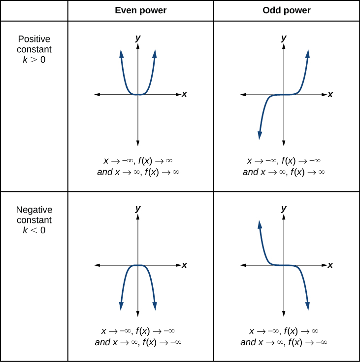
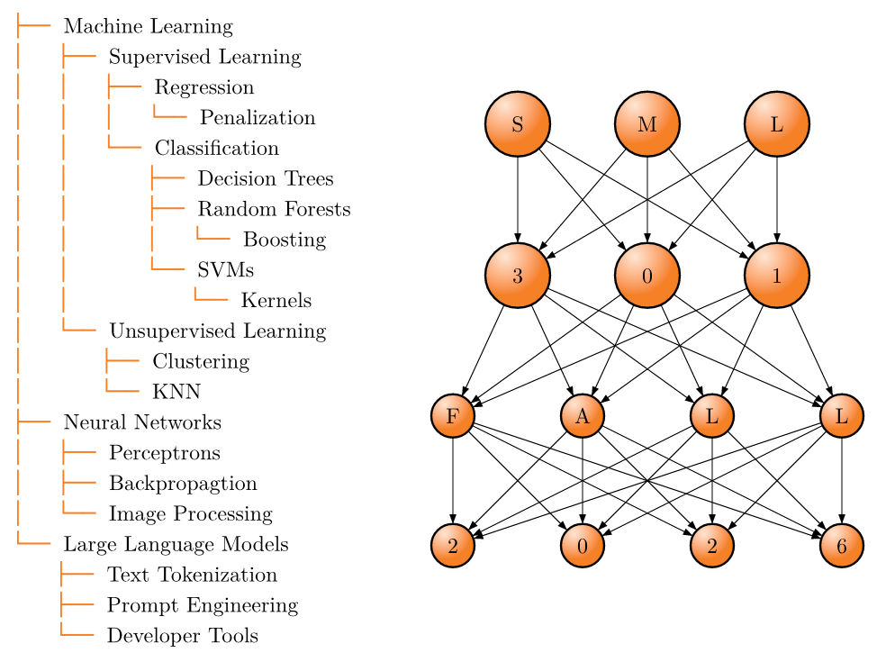

# Start

:::: {.columns}

::: {.column width="50%"}
* **Goal**: Explore nonlinear variables and regression

* **Objective**: Employ polynomial and exponential fits
:::

::: {.column width="10%"}

:::

::: {.column width="40%"}


* image source: [Lumen Learning](https://courses.lumenlearning.com/suny-dutchess-precalculus/chapter/power-functions-and-polynomial-functions/)

:::

::::

::: {.callout-note collapse="true"}
## Libraries and Helper Functions

```{r}
#| message: false
#| warning: false
library("gt")
library("janitor")   #tools for data cleaning
library("tidyverse") #tools for data wrangling and visualization

# user-defined function
cor2text <- function(x,y, num_digits = 4){
  # This function will compute a correlation, round the result, and describe the results
  # INPUTS:
  ## x: numerical vector
  ## y: numerical vector
  ## num_digits: number of digits for rounding (default: 4)
  # OUTPUT: string
  
  r = cor(x,y, use = "pairwise.complete.obs")
  
  cor_des <- case_when(
    r >= 0.7 ~ "strongly and positively correlated",
    r >= 0.4 & r < 0.7 ~ "slightly and positively correlated",
    r <= -0.4 & r > -0.7 ~ "slightly and negatively correlated",
    r <= -0.7 ~ "strongly and negatively correlated",
    .default = "virtually uncorrelated"
  )
  
  #return
  paste0("r = ", round(r, num_digits),
         ", ", cor_des)
}

# school colors
princeton_orange <- "#E77500"
princeton_black  <- "#121212"
```
:::


## Moore's Law

::::: {.panel-tabset}

### Statement

:::: {.columns}

::: {.column width="45%"}
)

Gordon Moore, co-founder of Intel

* image source: [Wikipedia](https://en.wikipedia.org/wiki/Gordon_Moore)

:::

::: {.column width="10%"}
	
:::

::: {.column width="45%"}
:::::: {style="font-size: 1.5em;"}
The number of transistors in an integrated circuit doubles about every two years
::::::

* stated in 1965
* but does it apply decades later?

:::

::::

### Description


Variables

* `year`
* `transitors`: tiny semiconductor devices that act as switches or amplifiers in an integrated circuit (IC)
* `clock_m_hz`: how fast an integrated circuit's internal clock pulses (MHz)
* `power_density_w_cm2`: how much power a chip can handle relative to its physical size (W/cm^2)
* `cores`: processing units for computations

### Load

```{r}
#| message: false
#| warning: false

# https://github.com/wallento/mooreandmore?tab=readme-ov-file
moore_df <- readr::read_csv("moores_law_data.csv") |>
  janitor::clean_names()
```

### egg

If you want to check how many cores your computer has, this useful `R` code will compute that.

```{r}
parallel::detectCores()
```


:::::


# Linear Regression

$$y = a + bx$$

```{r}
mod1 <- lm(transistors ~ year, data = moore_df)
```

We continue to use a coefficient of determination to judge the quality of a regression model.

```{r}
summary(mod1)$adj.r.squared
```

> This coefficient of determination says that we can explain about 27 percent of the variance in number of transistors with this model.

## Scatterplot

::::: {.panel-tabset}

### plot

```{r}
#| echo: false
#| eval: true

moore_df |>
  ggplot(aes(x = year, y = transistors)) +
  geom_point(color = "gray40", size = 2) +
  geom_smooth(formula = "y ~ x",
              method = "lm",
              se = FALSE,
              stat = "smooth") +
  labs(title = "Moore's Law",
       subtitle = cor2text(moore_df$year,
                           moore_df$transistors),
       caption = "SML 201",
       x = "year", y = "number of transistors") +
  scale_x_continuous(breaks = 1971:2015,
                     labels = as.character(1971:2015)) +
  theme_minimal() +
  theme(axis.text.x = element_text(angle = 90, vjust = 0.5, hjust=1))
```

### code

```{r}
#| echo: true
#| eval: false

moore_df |>
  ggplot(aes(x = year, y = transistors)) +
  geom_point(color = "gray40", size = 2) +
  geom_smooth(formula = "y ~ x",
              method = "lm",
              se = FALSE,
              stat = "smooth") +
  labs(title = "Moore's Law",
       subtitle = cor2text(moore_df$year,
                           moore_df$transistors),
       caption = "SML 201",
       x = "year", y = "number of transistors") +
  scale_x_continuous(breaks = 1971:2015,
                     labels = as.character(1971:2015)) +
  theme_minimal() +
  theme(axis.text.x = element_text(angle = 90, vjust = 0.5, hjust=1))
```

:::::


# Quadratic Regression

$$y = a + bx + cx^{2}$$

```{r}
mod2 <- lm(transistors ~ year + I(year^{2}), data = moore_df)
mod2
```

```{r}
pred_value <- predict(mod2, newdata = data.frame(year = 2026))
format(pred_value, scientific = TRUE)
```

> With this model, we predict that the 2026 ICs will have about 5 billion transistors.


::: {.callout-warning}
## DCP1
:::


# Polynomial Regression

In math, we say that the **basis** of power functions is the set

$$\{ 1, x, x^{2}, x^{3}, x^{4}, ...\}$$

and we can expand regression models as

$$y = a + bx + cx^{2} + dx^{3} + ...$$

or

$$y = \beta_{0} + \beta_{1}x + \beta_{2}x^{2} + \beta_{3}x^{3} + ...$$


## Degree 2

```{r}
d2_fit <- lm(transistors ~ poly(year, 2, raw = TRUE),
             data = moore_df)
summary(d2_fit)
```

```{r}
d2_fit <- lm(transistors ~ poly(year, 2, raw = FALSE),
             data = moore_df)
summary(d2_fit)
```

::: {.callout-note collapse="true"}
## (optional) Orthogonal Bases

The use of `poly` in regression tasks has a choice

* `raw = TRUE` employs the power function basis

$$y = \beta_{0} + \beta_{1}x + \beta_{2}x^{2} + \beta_{3}x^{3} + ...$$
but internal calculations are highly redundant and prone to be unstable.

* `raw = FALSE` (the default setting) employs **orthogonal polynomials** to avoid the redundancy and aim for numerical stability.  The *Chebyshev Polynomials*

$$\{1, x, 2x^{2} - 1, 4x^{3} - 3x, ... \}$$
are an example of a basis of orthogonal polynomials, but `poly` employs an algorithm whose weights are based on the explanatory variable.

:::

## Degree 3

```{r}
d3_fit <- lm(transistors ~ poly(year, 3, raw = FALSE),
             data = moore_df)
summary(d3_fit)
```


## Degree 4

```{r}
d4_fit <- lm(transistors ~ poly(year, 4, raw = FALSE),
             data = moore_df)
summary(d4_fit)
```

## Linear Revisited

```{r}
d1_fit <- lm(transistors ~ poly(year, 1, raw = FALSE),
             data = moore_df)
summary(d1_fit)
```


## Graphing Polynomial Fits

::::: {.panel-tabset}

### augment

```{r}
new_data = data.frame(year = moore_df$year)
moore_wide <- moore_df |>
  mutate(d1_preds = predict(d1_fit, new_data),
         d2_preds = predict(d2_fit, new_data),
         d3_preds = predict(d3_fit, new_data),
         d4_preds = predict(d4_fit, new_data))
```

### pivot

```{r}
moore_long <- moore_wide |>
  pivot_longer(cols = matches("preds"),
               names_to = "model_id",
               values_to = "preds")
```

### plot

```{r}
moore_long |>
  ggplot(aes(x = year, y = transistors)) +
  geom_point(color = "gray40", size = 2) +
  geom_line(aes(x = year, y = preds,
                color = model_id)) +
  labs(title = "Moore's Law",
       subtitle = cor2text(moore_df$year,
                           moore_df$transistors),
       caption = "SML 201",
       x = "year", y = "number of transistors") +
  scale_x_continuous(breaks = 1971:2015,
                     labels = as.character(1971:2015)) +
  theme_minimal() +
  theme(axis.text.x = element_text(angle = 90, vjust = 0.5, hjust=1))
```

:::::

## Metrics

::::: {.panel-tabset}

### gather

```{r}
new_point <- data.frame(year = 2026)
model_used <- c("d1_fit", "d2_fit", "d3_fit", "d4_fit")

mult_r2 <- c(
  summary(d1_fit)$r.squared,
  summary(d2_fit)$r.squared,
  summary(d3_fit)$r.squared,
  summary(d4_fit)$r.squared
)

preds2026 <- c(
  predict(d1_fit, new_point),
  predict(d2_fit, new_point),
  predict(d3_fit, new_point),
  predict(d4_fit, new_point)
)
model_summary_df <- data.frame(model_used, mult_r2, preds2026)
```

### gt

```{r}
#| echo: false
#| eval: true
model_summary_df |>
  gt() |>
  cols_align(align = "center") |>
  cols_label(model_used = "model",
             mult_r2 = "multiple R^2",
             preds2026 = "prediction") |>
  fmt_number(columns = mult_r2, decimals = 4) |>
  fmt_scientific(columns = preds2026) |>
  tab_footnote(footnote = "SML 201") |>
  tab_header(
    title = "Transistor Count for the Year 2026",
    subtitle = "Models, Metrics, and Predictions"
  ) |>
  tab_style(
    style = cell_text(weight = "bold"),
    locations = cells_column_labels()
  ) |>
  tab_style(
    style = cell_fill(color = princeton_orange),
    locations = cells_body(rows = mult_r2 == max(mult_r2))
  ) |>
  tab_style(
    style = cell_text(weight = "bold"),
    locations = cells_body(columns = c(mult_r2),
                           rows = mult_r2 == max(mult_r2))
  )
```

### code

```{r}
#| echo: true
#| eval: false
model_summary_df |>
  gt() |>
  cols_align(align = "center") |>
  cols_label(model_used = "model",
             mult_r2 = "multiple R^2",
             preds2026 = "prediction") |>
  fmt_number(columns = mult_r2, decimals = 4) |>
  fmt_scientific(columns = preds2026) |>
  tab_footnote(footnote = "SML 201") |>
  tab_header(
    title = "Transistor Count for the Year 2026",
    subtitle = "Models, Metrics, and Predictions"
  ) |>
  tab_style(
    style = cell_text(weight = "bold"),
    locations = cells_column_labels()
  ) |>
  tab_style(
    style = cell_fill(color = princeton_orange),
    locations = cells_body(rows = mult_r2 == max(mult_r2))
  ) |>
  tab_style(
    style = cell_text(weight = "bold"),
    locations = cells_body(columns = c(mult_r2),
                           rows = mult_r2 == max(mult_r2))
  )
```

:::::

::: {.callout-warning}
## DCP2
:::


# Coefficients of Determination

## Multiple $R^2$

$$R^{2} = \frac{\text{SSE(mean)} - \text{SSE(model)}}{\text{SSE(mean)}}$$

::: {.callout-important}
## Why not Multiple $R^2$?

As we increase the degree of the polynomials (as we increase the complexity of models), the multiple $R^2$ value will almost always increase (toward 1.0), implying better models; but then tend to commit *overfitting*
:::

## Adjusted $R^2$

$$R_\text{adj}^{2} = \frac{\frac{\text{SSE(mean)}}{n - k_{\text{mean}}} - \frac{\text{SSE(model)}}{n - k_{\text{model}}}}{\frac{\text{SSE(mean)}}{n - k_{\text{mean}}}}$$

* $n$: sample size (number of observations)
* $k_\text{mean} = 1$: number of target variables
* $k_\text{model}$: number of explanatory variables

::: {.callout-tip}
## Adjusted $R^2$

The **adjusted** $R^2$ value *penalizes* models that have more parameters and yields an arguably more reliable coefficient of determination.
:::

## Metrics

::::: {.panel-tabset}

### gather

```{r}
new_point <- data.frame(year = 2026)
model_used <- c("d1_fit", "d2_fit", "d3_fit", "d4_fit")

mult_r2 <- c(
  summary(d1_fit)$r.squared,
  summary(d2_fit)$r.squared,
  summary(d3_fit)$r.squared,
  summary(d4_fit)$r.squared
)

adj_r2 <- c(
  summary(d1_fit)$adj.r.squared,
  summary(d2_fit)$adj.r.squared,
  summary(d3_fit)$adj.r.squared,
  summary(d4_fit)$adj.r.squared
)

preds2026 <- c(
  predict(d1_fit, new_point),
  predict(d2_fit, new_point),
  predict(d3_fit, new_point),
  predict(d4_fit, new_point)
)
model_summary_df <- data.frame(model_used, mult_r2, adj_r2, preds2026)
```

### gt

```{r}
#| echo: false
#| eval: true
model_summary_df |>
  gt() |>
  cols_align(align = "center") |>
  cols_label(model_used = "model",
             mult_r2 = "multiple R^2",
             adj_r2 = "adjusted R^2",
             preds2026 = "prediction") |>
  fmt_number(columns = c(mult_r2, adj_r2), decimals = 4) |>
  fmt_scientific(columns = preds2026) |>
  tab_footnote(footnote = "SML 201") |>
  tab_header(
    title = "Transistor Count for the Year 2026",
    subtitle = "Models, Metrics, and Predictions"
  ) |>
  tab_style(
    style = cell_text(weight = "bold"),
    locations = cells_column_labels()
  ) |>
  tab_style(
    style = cell_fill(color = princeton_orange),
    locations = cells_body(rows = adj_r2 == max(adj_r2))
  ) |>
  tab_style(
    style = cell_text(weight = "bold"),
    locations = cells_body(columns = c(adj_r2),
                           rows = adj_r2 == max(adj_r2))
  )
```

### code

```{r}
#| echo: true
#| eval: false
model_summary_df |>
  gt() |>
  cols_align(align = "center") |>
  cols_label(model_used = "model",
             mult_r2 = "multiple R^2",
             adj_r2 = "adjusted R^2",
             preds2026 = "prediction") |>
  fmt_number(columns = c(mult_r2, adj_r2), decimals = 4) |>
  fmt_scientific(columns = preds2026) |>
  tab_footnote(footnote = "SML 201") |>
  tab_header(
    title = "Transistor Count for the Year 2026",
    subtitle = "Models, Metrics, and Predictions"
  ) |>
  tab_style(
    style = cell_text(weight = "bold"),
    locations = cells_column_labels()
  ) |>
  tab_style(
    style = cell_fill(color = princeton_orange),
    locations = cells_body(rows = adj_r2 == max(adj_r2))
  ) |>
  tab_style(
    style = cell_text(weight = "bold"),
    locations = cells_body(columns = c(adj_r2),
                           rows = adj_r2 == max(adj_r2))
  )
```

:::::

::: {.callout-warning}
## DCP3
:::


# Exponential Regression

::::: {.panel-tabset}

## math

$$\begin{array}{rcl}
y & = & A(B^{x}) \\
\ln y & = & \ln A(B^{x}) \\
\ln y & = & \ln A + x\ln B \\
\end{array}$$

* response variable: log(`transistors`)
* $\beta_0 = \ln A$ and $\beta_{1} = \ln B$

## model

```{r}
exp_fit <- lm(log(transistors) ~ year, data = moore_df)
exp_fit
```

## predict

```{r}
pred_value <- exp(predict(exp_fit, data.frame(year = 2026)))
format(pred_value, scientific = TRUE)
```

> With this model, we predict that the 2026 ICs will have about 130 billion transistors (close to reality!)

## plot

```{r}
#| echo: false
#| eval: true

moore_df <- moore_df |>
  mutate(exp_preds = exp(predict(exp_fit, new_data)))

moore_df |>
  ggplot(aes(x = year, y = transistors)) +
  geom_point(color = "gray40", size = 4) +
  geom_line(aes(x = year, y = exp_preds),
            color = "blue", linewidth = 2) +
  labs(title = "US Hurricanes",
       subtitle = cor2text(moore_df$year,
                           moore_df$transistors),
       caption = "SML 201",
       x = "year", y = "total damage (millions of dollars)") +
  scale_x_continuous(breaks = 1971:2015,
                     labels = as.character(1971:2015)) +
  theme_minimal() +
  theme(axis.text.x = element_text(angle = 90, vjust = 0.5, hjust=1))
```

## code

```{r}
#| echo: true
#| eval: false

moore_df <- moore_df |>
  mutate(exp_preds = exp(predict(exp_fit, new_data)))

moore_df |>
  ggplot(aes(x = year, y = transistors)) +
  geom_point(color = "gray40", size = 4) +
  geom_line(aes(x = year, y = exp_preds),
            color = "blue", linewidth = 2) +
  labs(title = "US Hurricanes",
       subtitle = cor2text(moore_df$year,
                           moore_df$transistors),
       caption = "SML 201",
       x = "year", y = "total damage (millions of dollars)") +
  scale_x_continuous(breaks = 1971:2015,
                     labels = as.character(1971:2015)) +
  theme_minimal() +
  theme(axis.text.x = element_text(angle = 90, vjust = 0.5, hjust=1))
```

:::::


## Metrics

::::: {.panel-tabset}

### gather

```{r}
new_point <- data.frame(year = 2026)
model_used <- c("d1_fit", "d2_fit", "d3_fit", "d4_fit", "exp_fit")

mult_r2 <- c(
  summary(d1_fit)$r.squared,
  summary(d2_fit)$r.squared,
  summary(d3_fit)$r.squared,
  summary(d4_fit)$r.squared,
  summary(exp_fit)$r.squared
)

adj_r2 <- c(
  summary(d1_fit)$adj.r.squared,
  summary(d2_fit)$adj.r.squared,
  summary(d3_fit)$adj.r.squared,
  summary(d4_fit)$adj.r.squared,
  summary(exp_fit)$adj.r.squared
)

preds2026 <- c(
  predict(d1_fit, new_point),
  predict(d2_fit, new_point),
  predict(d3_fit, new_point),
  predict(d4_fit, new_point),
  exp(predict(exp_fit, new_point))
)
model_summary_df <- data.frame(model_used, mult_r2, adj_r2, preds2026)
```

### gt

```{r}
#| echo: false
#| eval: true
model_summary_df |>
  gt() |>
  cols_align(align = "center") |>
  cols_label(model_used = "model",
             mult_r2 = "multiple R^2",
             adj_r2 = "adjusted R^2",
             preds2026 = "prediction") |>
  fmt_number(columns = c(mult_r2, adj_r2), decimals = 4) |>
  fmt_scientific(columns = preds2026) |>
  tab_footnote(footnote = "SML 201") |>
  tab_header(
    title = "Transistor Count for the Year 2026",
    subtitle = "Models, Metrics, and Predictions"
  ) |>
  tab_style(
    style = cell_text(weight = "bold"),
    locations = cells_column_labels()
  ) |>
  tab_style(
    style = cell_fill(color = princeton_orange),
    locations = cells_body(rows = adj_r2 == max(adj_r2))
  ) |>
  tab_style(
    style = cell_text(weight = "bold"),
    locations = cells_body(columns = c(adj_r2),
                           rows = adj_r2 == max(adj_r2))
  )
```

### code

```{r}
#| echo: true
#| eval: false
model_summary_df |>
  gt() |>
  cols_align(align = "center") |>
  cols_label(model_used = "model",
             mult_r2 = "multiple R^2",
             adj_r2 = "adjusted R^2",
             preds2026 = "prediction") |>
  fmt_number(columns = c(mult_r2, adj_r2), decimals = 4) |>
  fmt_scientific(columns = preds2026) |>
  tab_footnote(footnote = "SML 201") |>
  tab_header(
    title = "Transistor Count for the Year 2026",
    subtitle = "Models, Metrics, and Predictions"
  ) |>
  tab_style(
    style = cell_text(weight = "bold"),
    locations = cells_column_labels()
  ) |>
  tab_style(
    style = cell_fill(color = princeton_orange),
    locations = cells_body(rows = adj_r2 == max(adj_r2))
  ) |>
  tab_style(
    style = cell_text(weight = "bold"),
    locations = cells_body(columns = c(adj_r2),
                           rows = adj_r2 == max(adj_r2))
  )
```

:::::


## Present Day


* has about 134 billion transistors
  * albeit back in 2023
* image source: [Trusted Reviews](https://www.trustedreviews.com/versus/apple-m2-ultra-vs-apple-m2-max-4333725)


# Pitch




# Quo Vadimus?

:::: {.columns}

::: {.column width="45%"}
* Precept 9
* Reading_Week_10
* Group Partners (survey)
* Exam 2 (April 23)
* Project 3

  * assigned: April 24
  * due: May 11
:::

::: {.column width="10%"}
	
:::

::: {.column width="45%"}



* last-minute exam advice from 5 Second Films ([YouTube](https://www.youtube.com/watch?v=LXD4MGINIzQ))
:::

::::


# Footnotes

::: {.callout-note collapse="true"}
## (optional) Additional Resources

```{r}
#| eval: false
moore_long |>
  ggplot(aes(x = year, y = log10(transistors))) +
  geom_point(color = "gray40", size = 2) +
  geom_line(aes(x = year, y = log10(preds),
                color = model_id)) +
  labs(title = "Moore's Law",
       subtitle = cor2text(moore_df$year,
                           moore_df$transistors),
       caption = "SML 201",
       x = "year", y = "log(transistors)") +
  scale_x_continuous(breaks = 1971:2015,
                     labels = as.character(1971:2015)) +
  theme_minimal() +
  theme(axis.text.x = element_text(angle = 90, vjust = 0.5, hjust=1))
```

:::

::: {.callout-note collapse="true"}
## Session Info

```{r}
sessionInfo()
```
:::


:::: {.columns}

::: {.column width="45%"}
	
:::

::: {.column width="10%"}
	
:::

::: {.column width="45%"}

:::

::::

::::: {.panel-tabset}


:::::